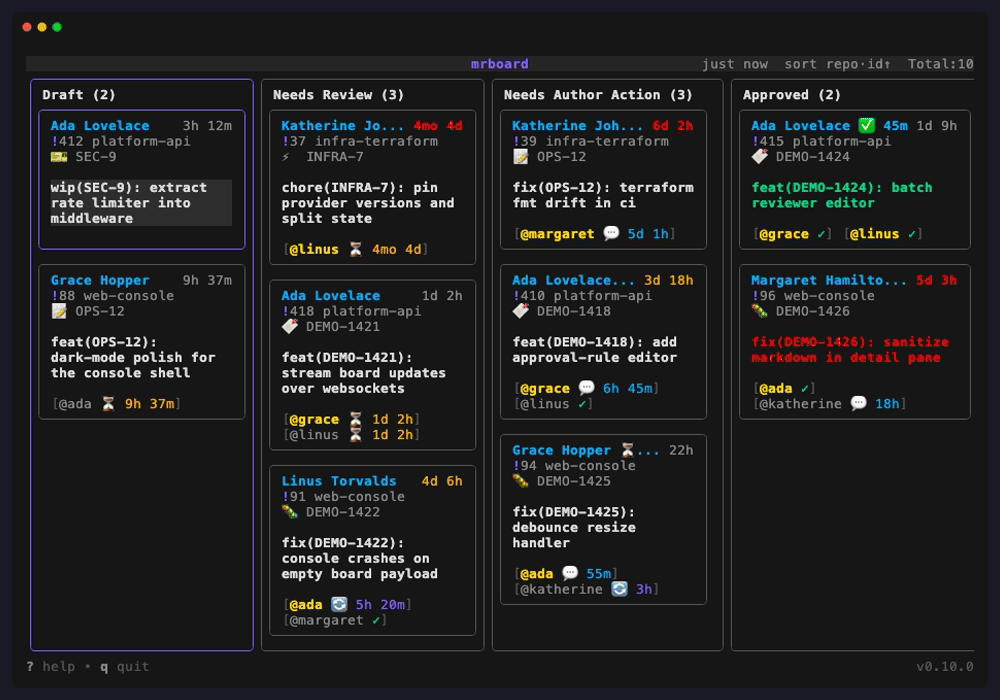

# mrboard

A terminal board for your team's GitLab merge requests — built for daily standups.



## Install

```bash
brew tap ceffo/tap
brew install mrboard
```

## Try it without a GitLab account

```bash
mrboard --demo
```

Runs the whole board against built-in fake data — no config file, no token, no network. Every
key works, including the reviewer editor and the diff view. Nothing is written to your cache
or state directories; writes only mutate the in-memory dataset.

## Quick start

Create `~/.config/mrboard/mrboard.yaml`:

```yaml
gitlab:
  url: https://gitlab.example.com
  token: glpat-xxx        # or set $GITLAB_TOKEN; needs api scope

sources:
  - type: group
    ids: [my-team]        # group paths, numeric IDs, or use type: user with usernames

current_user: alice       # highlights your MRs and enables the "my view" toggle
```

Then run `mrboard`. That's the whole required surface — everything else is optional.

Issue-tracker integration, Teams notifications, custom themes, external command launchers, and
the full list of settings with their defaults are documented in
[docs/configuration.md](docs/configuration.md).

## How the board works

Cards are grouped by whose turn it is, not by GitLab's merge status:

| Column | An MR lands here when |
| --- | --- |
| **Draft** | it is marked draft — this wins over everything else |
| **Needs Review** | reviewers still owe feedback |
| **Needs Author Action** | at least one reviewer has commented; the ball is with the author |
| **Approved** | every *designated approver* has approved |

The Approved column is about approvers specifically. An MR with no designated approvers stays
in Needs Review however many plain reviewers approve it — mark approvers in the reviewer editor
(`v`, then `space`). GitLab's `detailed_merge_status` doesn't decide the column; it only tints
an approved card green when it is genuinely mergeable and red when something still blocks it.

Each reviewer shows as a pill with their state:

| | |
| --- | --- |
| ⏳ | hasn't started, with how long they've been waiting |
| 💬 | left comments |
| 🔄 | re-review requested after changes |
| ✓ | approved |

Card ages turn amber after `lifetime_warn_after` (72h) and red after `lifetime_error_after`
(120h).

## Keys

Press **`?`** for every binding available in the current context — that modal is the source of
truth, and the footer always shows the most useful ones for where you are.

The four worth knowing up front: `↵` opens the detail pane, `d` the diff view, `v` the reviewer
editor, and `,` the settings panel.

## CLI commands

Alongside the interactive board, `mrboard` has two one-shot commands for scripting and automation:

```bash
mrboard fetch    # fetch every configured MR and print it as JSON
mrboard auto     # run mrboard's automatic write actions once, outside the TUI
```

`fetch` mirrors exactly what the TUI fetches — same saved settings, same on-disk snapshot — and
never writes to GitLab. `--reviewer-mrs` overrides the saved "include reviewer-sourced MRs"
setting; `--cold` ignores the snapshot and recomputes every MR from scratch.

`update` runs mrboard's automatic write actions (currently: auto-assigning the team as reviewers
on newly opened, ticket-linked MRs — see `auto_assign_reviewers` in
[docs/configuration.md](docs/configuration.md)) as a standalone step, useful for a cron job when
nobody has the TUI open. It is a no-op unless `auto_assign_reviewers.enabled` is set. `--dry-run`
logs what would be assigned without writing to GitLab.

## Documentation

| | |
| --- | --- |
| [configuration.md](docs/configuration.md) | Every config key, defaults, env vars, troubleshooting |
| [theme-format.md](docs/theme-format.md) | Writing a custom theme |
| [architecture.md](docs/architecture.md) | Package boundaries and data flow |
| [domain-model.md](docs/domain-model.md) | Phase rules and the reviewer state machine |
| [adr/](docs/adr/) | Why things are built the way they are |

## Development

```bash
just check                    # fmt + lint + build + test
just demo-run                 # launch the board against the demo dataset
just demo                     # re-record the GIF from the working tree
just demo-release v0.10.0     # re-record it from a clean checkout of a tag
```

Use `demo-release` for the committed GIF: the version in the footer is stamped at
build time, so recording from the working tree labels the frame `-dirty`. Both need
[vhs](https://github.com/charmbracelet/vhs).

## Releasing

Merging a PR into `main` releases it. The squashed commit subject — the PR title — picks
the bump:

| PR title | Bump | Release |
| --- | --- | --- |
| `feat(tui): …` | minor | yes |
| `fix`, `perf`, `refactor`, `revert` | patch | yes |
| `build`, `chore`, `ci`, `docs`, `merge`, `release`, `style`, `test`, `wip` | none | no |
| `… [skip release]` | skip | no |
| any other type, or a subject that is not a conventional commit | unknown | no, with a warning on the run |

A `!` breaking marker bumps the minor, not the major — `v1.0.0` is only reachable
through `just release major`.

The last two rows are separate on purpose: `none` is a deliberate non-releasing merge,
`unknown` is usually a mistyped title. Both stop the release, but `unknown` annotates the
workflow run so an unreleased merge does not pass unnoticed. Check a title before merging
with:

```bash
just release-preview "feat(tui): add a column"
# level=minor
# version=v0.14.0
```

See [adr/0011](docs/adr/0011-auto-release-on-merge.md) for the full rationale.
