# Beads Export

*Generated: Tue, 30 Jun 2026 00:02:24 EDT*

## Summary

| Metric | Count |
|--------|-------|
| **Total** | 96 |
| Open | 2 |
| In Progress | 1 |
| Blocked | 0 |
| Closed | 93 |

## Quick Actions

Ready-to-run commands for bulk operations:

```bash
# Close all in-progress items
br close mrr-qtk.3

# Close all open items
br close mrr-qtk.4 mrr-qtk

# View high-priority items (P0/P1)
br show mrr-qtk.4 mrr-qtk.3 mrr-qtk

```

## Table of Contents

- [🟢 mrr-qtk.4 tui: idempotent write dispatch — diff staged vs current, skip API if no change](#mrr-qtk-4-tui-idempotent-write-dispatch-diff-staged-vs-current-skip-api-if-no-change)
- [🔵 mrr-qtk.3 tui: preview diff screen — selectable rows, per-MR change detection](#mrr-qtk-3-tui-preview-diff-screen-selectable-rows-per-mr-change-detection)
- [🟢 mrr-qtk Batch reviewer editor: E-key, sibling MRs, preview diff](#mrr-qtk-batch-reviewer-editor-e-key-sibling-mrs-preview-diff)
- [⚫ mrr-qtk.2 tui: batchReviewerEditorWidget — E key, pre-fill from focused card, list sibling MRs](#mrr-qtk-2-tui-batchreviewereditorwidget-e-key-pre-fill-from-focused-card-list-sibling-mrs)
- [⚫ mrr-qtk.1 tui: index MRs by JIRA ID in board model for sibling lookup](#mrr-qtk-1-tui-index-mrs-by-jira-id-in-board-model-for-sibling-lookup)
- [⚫ mrr-0bw.3 tui: S key toggle + board header sprint indicator; disable if board_id absent](#mrr-0bw-3-tui-s-key-toggle-board-header-sprint-indicator-disable-if-board-id-absent)
- [⚫ mrr-0bw.2 tui: sprint filter state in board model (active sprint issue key set)](#mrr-0bw-2-tui-sprint-filter-state-in-board-model-active-sprint-issue-key-set)
- [⚫ mrr-0bw.1 jiraadpt: implement GetActiveSprintIssueKeys via JIRA Agile API](#mrr-0bw-1-jiraadpt-implement-getactivesprintissuekeys-via-jira-agile-api)
- [⚫ mrr-hl4.2 gitlabadpt: auto-inject JIRA link on MR fetch — detect marker, append if missing, background](#mrr-hl4-2-gitlabadpt-auto-inject-jira-link-on-mr-fetch-detect-marker-append-if-missing-background)
- [⚫ mrr-hl4.1 pkg/gitlab + adapter: add UpdateMRDescription (PATCH MR body)](#mrr-hl4-1-pkg-gitlab-adapter-add-updatemrdescription-patch-mr-body)
- [⚫ mrr-9yi.4 tui: render JIRA line 3 on cardWidget (🎫 placeholder → icon + ID)](#mrr-9yi-4-tui-render-jira-line-3-on-cardwidget-placeholder-icon-id)
- [⚫ mrr-9yi.3 tui: async enrichment — background fetch of issue type, send update Msg](#mrr-9yi-3-tui-async-enrichment-background-fetch-of-issue-type-send-update-msg)
- [⚫ mrr-9yi.2 tui: issue type icon resolver (default map + config overrides)](#mrr-9yi-2-tui-issue-type-icon-resolver-default-map-config-overrides)
- [⚫ mrr-9yi.1 domain: add JiraIssueType field to MergeRequest](#mrr-9yi-1-domain-add-jiraissuetype-field-to-mergerequest)
- [⚫ mrr-6bb.5 core: wire jiraadpt into composition root](#mrr-6bb-5-core-wire-jiraadpt-into-composition-root)
- [⚫ mrr-6bb.4 jiraadpt: adapter implementing JiraEnricher with 24h disk cache](#mrr-6bb-4-jiraadpt-adapter-implementing-jiraenricher-with-24h-disk-cache)
- [⚫ mrr-6bb.3 jirasvc: JiraEnricher port (GetIssueType, GetActiveSprintIssueKeys)](#mrr-6bb-3-jirasvc-jiraenricher-port-getissuetype-getactivesprintissuekeys)
- [⚫ mrr-6bb.2 pkg/jira: thin HTTP client — auth, GetIssue, GetActiveSprint](#mrr-6bb-2-pkg-jira-thin-http-client-auth-getissue-getactivesprint)
- [⚫ mrr-6bb.1 Config: add email, api_token, board_id, cache_ttl, issue_type_icons to jira block](#mrr-6bb-1-config-add-email-api-token-board-id-cache-ttl-issue-type-icons-to-jira-block)
- [⚫ mrr-9yi Card JIRA line: issue type display & async enrichment](#mrr-9yi-card-jira-line-issue-type-display-async-enrichment)
- [⚫ mrr-6bb JIRA API client, adapter & port](#mrr-6bb-jira-api-client-adapter-port)
- [⚫ mrr-3dy.2 Extract explicit fetch pipeline stages in gitlabadpt (list → dedup → enrich)](#mrr-3dy-2-extract-explicit-fetch-pipeline-stages-in-gitlabadpt-list-dedup-enrich)
- [⚫ mrr-3dy.1 Introduce DiscussionEvent domain type to unify REST/GQL reviewer state machine](#mrr-3dy-1-introduce-discussionevent-domain-type-to-unify-rest-gql-reviewer-state-machine)
- [⚫ mrr-ypr.10 tui: delete filter_popup.go + theme_picker.go, wire SettingsAppliedMsg into model](#mrr-ypr-10-tui-delete-filter-popup-go-theme-picker-go-wire-settingsappliedmsg-into-model)
- [⚫ mrr-ypr.9 tui: new settings_widget.go — 4-tab panel (General/Filters/Sorting/Theme)](#mrr-ypr-9-tui-new-settings-widget-go-4-tab-panel-general-filters-sorting-theme)
- [⚫ mrr-ypr.8 tui/keys: remove f/t bindings, add comma for settings, add SettingsKeyMap](#mrr-ypr-8-tui-keys-remove-f-t-bindings-add-comma-for-settings-add-settingskeymap)
- [⚫ mrr-ypr.7 tui/model: load/save filter+reviewer from AppState, pass FetchOptions to FetchAll](#mrr-ypr-7-tui-model-load-save-filter-reviewer-from-appstate-pass-fetchoptions-to-fetchall)
- [⚫ mrr-ypr.6 domain: extend AppState with Filter FilterCriteria + IncludeReviewerMRs bool](#mrr-ypr-6-domain-extend-appstate-with-filter-filtercriteria-includereviewermrs-bool)
- [⚫ mrr-ypr.5 domain: move FilterCriteria to domain package with yaml tags](#mrr-ypr-5-domain-move-filtercriteria-to-domain-package-with-yaml-tags)
- [⚫ mrr-ypr.4 gitlabadpt: wire reviewer fetch into FetchAll when opts.IncludeReviewerMRs](#mrr-ypr-4-gitlabadpt-wire-reviewer-fetch-into-fetchall-when-opts-includereviewermrs)
- [⚫ mrr-ypr.3 pkg/gitlab: add GQL reviewRequestedMergeRequests query + REST fallback for reviewer MRs](#mrr-ypr-3-pkg-gitlab-add-gql-reviewrequestedmergerequests-query-rest-fallback-for-reviewer-mrs)
- [⚫ mrr-ypr.2 core+adapter: derive reviewer usernames from user sources + current_user, extend gitlabadpt.Config](#mrr-ypr-2-core-adapter-derive-reviewer-usernames-from-user-sources-current-user-extend-gitlabadpt-config)
- [⚫ mrr-ypr.1 mrsvc: add FetchOptions struct, change FetchAll signature, regenerate mocks](#mrr-ypr-1-mrsvc-add-fetchoptions-struct-change-fetchall-signature-regenerate-mocks)
- [⚫ mrr-ypr feat: settings view + include reviewer MRs](#mrr-ypr-feat-settings-view-include-reviewer-mrs)
- [⚫ mrr-4hj.4 feat(tui): approver editor overlay + single-MR re-fetch](#mrr-4hj-4-feat-tui-approver-editor-overlay-single-mr-re-fetch)
- [⚫ mrr-4hj.3 feat(tui): ColorApprover theme token + card/detail approval display](#mrr-4hj-3-feat-tui-colorapprover-theme-token-card-detail-approval-display)
- [⚫ mrr-4hj.2 feat(gitlab+adapter): GQL approval rules + detailedMergeStatus + write methods](#mrr-4hj-2-feat-gitlab-adapter-gql-approval-rules-detailedmergestatus-write-methods)
- [⚫ mrr-4hj.1 refactor(domain+config): remove ApprovalCount/RequiredApprovals, add IsApprover, update ClassifyPhase](#mrr-4hj-1-refactor-domain-config-remove-approvalcount-requiredapprovals-add-isapprover-update-classifyphase)
- [⚫ mrr-4hj feat: reviewers vs approvers](#mrr-4hj-feat-reviewers-vs-approvers)
- [⚫ mrr-3rn perf: GraphQL per-user fetch + live refresh overlay](#mrr-3rn-perf-graphql-per-user-fetch-live-refresh-overlay)
- [⚫ mrr-r4e Wiring: internal/core/ + root context + signal handling + --config flag](#mrr-r4e-wiring-internal-core-root-context-signal-handling-config-flag)
- [⚫ mrr-rt6 State: internal/adapters/statestore/ + TUI ViewMode enum + StateStore injection](#mrr-rt6-state-internal-adapters-statestore-tui-viewmode-enum-statestore-injection)
- [⚫ mrr-xhh Service layer: internal/domain/service/mrsvc/ + pkg/gitlab/ + internal/adapters/gitlabadpt/](#mrr-xhh-service-layer-internal-domain-service-mrsvc-pkg-gitlab-internal-adapters-gitlabadpt)
- [⚫ mrr-5f3 Foundation: MIT license + internal/log/ + internal/config/ (Viper + ozzo)](#mrr-5f3-foundation-mit-license-internal-log-internal-config-viper-ozzo)
- [⚫ mrr-l7g Clean architecture alignment — ports, adapters, config, logging](#mrr-l7g-clean-architecture-alignment-ports-adapters-config-logging)
- [⚫ mrr-801.1 US-001: Extract MergeRequestSource port and inject into TUI](#mrr-801-1-us-001-extract-mergerequestsource-port-and-inject-into-tui)
- [⚫ mrr-jga.4 US-001+002: Layout chrome — header widget, docked footer, WindowSizeMsg wiring](#mrr-jga-4-us-001-002-layout-chrome-header-widget-docked-footer-windowsizemsg-wiring)
- [⚫ mrr-jga.2 US-002: Docked footer](#mrr-jga-2-us-002-docked-footer)
- [⚫ mrr-jga.1 US-001: Persistent app header with centered title and right-aligned stats](#mrr-jga-1-us-001-persistent-app-header-with-centered-title-and-right-aligned-stats)
- [⚫ mrr-88x.4 US-005: MR phase classification](#mrr-88x-4-us-005-mr-phase-classification)
- [⚫ mrr-88x.3 US-002: GitLab API client](#mrr-88x-3-us-002-gitlab-api-client)
- [⚫ mrr-88x.2 US-001: Config loading](#mrr-88x-2-us-001-config-loading)
- [⚫ mrr-88x.1 US-003: Domain types](#mrr-88x-1-us-003-domain-types)
- [⚫ mrr-0bw Sprint filter: S-key toggle via JIRA Agile API](#mrr-0bw-sprint-filter-s-key-toggle-via-jira-agile-api)
- [⚫ mrr-hl4 MR description write-back: auto-inject JIRA link](#mrr-hl4-mr-description-write-back-auto-inject-jira-link)
- [⚫ mrr-1cu.4 Verify reviewer editor with agent-tui + docs note](#mrr-1cu-4-verify-reviewer-editor-with-agent-tui-docs-note)
- [⚫ mrr-1cu.3 Reviewer editor widget (replaces approver editor)](#mrr-1cu-3-reviewer-editor-widget-replaces-approver-editor)
- [⚫ mrr-1cu.2 TUI startup team resolution (cached, with feedback)](#mrr-1cu-2-tui-startup-team-resolution-cached-with-feedback)
- [⚫ mrr-1cu.1 Domain User type + reviewer/resolve ports + client + mocks](#mrr-1cu-1-domain-user-type-reviewer-resolve-ports-client-mocks)
- [⚫ mrr-1cu Unified reviewer editor (edit reviewers; approver as flag)](#mrr-1cu-unified-reviewer-editor-edit-reviewers-approver-as-flag)
- [⚫ mrr-3dy.3 Extract OverlayRouter from model.go to own focus/overlay state machine](#mrr-3dy-3-extract-overlayrouter-from-model-go-to-own-focus-overlay-state-machine)
- [⚫ mrr-3dy Architecture deepening: reduce accidental complexity](#mrr-3dy-architecture-deepening-reduce-accidental-complexity)
- [⚫ mrr-28q.4 Define FilterCriteria value type as single source of truth for filter state](#mrr-28q-4-define-filtercriteria-value-type-as-single-source-of-truth-for-filter-state)
- [⚫ mrr-28q.3 Extract MRDeduplicator seam from FetchAll orchestration](#mrr-28q-3-extract-mrdeduplicator-seam-from-fetchall-orchestration)
- [⚫ mrr-28q.2 Invert StateStore dependency: domain.AppState replaces tui.State in persistence](#mrr-28q-2-invert-statestore-dependency-domain-appstate-replaces-tui-state-in-persistence)
- [⚫ mrr-28q.1 Extract ReviewerStateDeriver interface from dual REST/GQL mapper paths](#mrr-28q-1-extract-reviewerstatederiver-interface-from-dual-rest-gql-mapper-paths)
- [⚫ mrr-28q Architectural deepening: from shallow adapters to deep modules](#mrr-28q-architectural-deepening-from-shallow-adapters-to-deep-modules)
- [⚫ mrr-ptv Architectural deepening: from shallow adapters to deep modules](#mrr-ptv-architectural-deepening-from-shallow-adapters-to-deep-modules)
- [⚫ mrr-h2o Package shell completions in homebrew cask](#mrr-h2o-package-shell-completions-in-homebrew-cask)
- [⚫ mrr-i8s Migrate CLI entrypoint to cobra](#mrr-i8s-migrate-cli-entrypoint-to-cobra)
- [⚫ mrr-pes CLI Distribution & Packaging](#mrr-pes-cli-distribution-packaging)
- [⚫ mrr-erc.2 Username consistency: lookup table, @ prefix, full-name display](#mrr-erc-2-username-consistency-lookup-table-prefix-full-name-display)
- [⚫ mrr-erc.1 TUI display fixes: hide unreviewed MRs, two-line titles, minute refresh](#mrr-erc-1-tui-display-fixes-hide-unreviewed-mrs-two-line-titles-minute-refresh)
- [⚫ mrr-erc TUI UX Polish — display consistency & refresh](#mrr-erc-tui-ux-polish-display-consistency-refresh)
- [⚫ mrr-801.5 US-005: Add TUI unit tests using MockMRSource](#mrr-801-5-us-005-add-tui-unit-tests-using-mockmrsource)
- [⚫ mrr-801.3 US-003: Introduce a composition root](#mrr-801-3-us-003-introduce-a-composition-root)
- [⚫ mrr-801.2 US-002: Extract filter and sort logic into a pure service function](#mrr-801-2-us-002-extract-filter-and-sort-logic-into-a-pure-service-function)
- [⚫ mrr-801 Multi-Frontend Architecture Refactor](#mrr-801-multi-frontend-architecture-refactor)
- [⚫ mrr-zb8 Add filter popup (phase, author, reviewer)](#mrr-zb8-add-filter-popup-phase-author-reviewer)
- [⚫ mrr-jga.3 US-003: Per-lane vertical scrolling](#mrr-jga-3-us-003-per-lane-vertical-scrolling)
- [⚫ mrr-jga mrboard TUI Layout Improvements](#mrr-jga-mrboard-tui-layout-improvements)
- [⚫ mrr-8cp MR details panel: pop-in from right on Enter](#mrr-8cp-mr-details-panel-pop-in-from-right-on-enter)
- [⚫ mrr-88x.14 Observability: HTTP timeout, fetch subcommand, file logging](#mrr-88x-14-observability-http-timeout-fetch-subcommand-file-logging)
- [⚫ mrr-88x.8 US-008: Data fetching and deduplication](#mrr-88x-8-us-008-data-fetching-and-deduplication)
- [⚫ mrr-88x.7 US-007: Round-trip counting](#mrr-88x-7-us-007-round-trip-counting)
- [⚫ mrr-88x.6 US-004: Reviewer state derivation](#mrr-88x-6-us-004-reviewer-state-derivation)
- [⚫ mrr-88x.5 US-006: Time tracking](#mrr-88x-5-us-006-time-tracking)
- [⚫ mrr-88x mrboard — GitLab MR Review Board TUI](#mrr-88x-mrboard-gitlab-mr-review-board-tui)
- [⚫ mrr-3dy.4 Split pkg/gitlab/client into semantic sub-interfaces (MRLister, MREnricher, MRWriter)](#mrr-3dy-4-split-pkg-gitlab-client-into-semantic-sub-interfaces-mrlister-mrenricher-mrwriter)
- [⚫ mrr-28q.5 Separate card height measurement from card rendering in column layout](#mrr-28q-5-separate-card-height-measurement-from-card-rendering-in-column-layout)
- [⚫ mrr-801.4 US-004: Promote FetchAll from free function to adapter method with context](#mrr-801-4-us-004-promote-fetchall-from-free-function-to-adapter-method-with-context)
- [⚫ mrr-88x.13 TUI — full board implementation](#mrr-88x-13-tui-full-board-implementation)
- [⚫ mrr-88x.11 US-011: Loading and error states](#mrr-88x-11-us-011-loading-and-error-states)
- [⚫ mrr-88x.10 US-010: Keyboard navigation and interactions](#mrr-88x-10-us-010-keyboard-navigation-and-interactions)
- [⚫ mrr-88x.9 US-009: Kanban board TUI](#mrr-88x-9-us-009-kanban-board-tui)
- [⚫ mrr-88x.12 US-012: Backend/frontend decoupling verification](#mrr-88x-12-us-012-backend-frontend-decoupling-verification)

---

## Dependency Graph

```mermaid
graph TD
    classDef open fill:#50FA7B,stroke:#333,color:#000
    classDef inprogress fill:#8BE9FD,stroke:#333,color:#000
    classDef blocked fill:#FF5555,stroke:#333,color:#000
    classDef closed fill:#6272A4,stroke:#333,color:#fff

    mrr-0bw["mrr-0bw<br/>Sprint filter: S-key toggle via JIRA ..."]
    class mrr-0bw closed
    mrr-0bw1["mrr-0bw.1<br/>jiraadpt: implement GetActiveSprintIs..."]
    class mrr-0bw1 closed
    mrr-0bw2["mrr-0bw.2<br/>tui: sprint filter state in board mod..."]
    class mrr-0bw2 closed
    mrr-0bw3["mrr-0bw.3<br/>tui: S key toggle + board header spri..."]
    class mrr-0bw3 closed
    mrr-1cu["mrr-1cu<br/>Unified reviewer editor (edit reviewe..."]
    class mrr-1cu closed
    mrr-1cu1["mrr-1cu.1<br/>Domain User type + reviewer/resolve p..."]
    class mrr-1cu1 closed
    mrr-1cu2["mrr-1cu.2<br/>TUI startup team resolution (cached, ..."]
    class mrr-1cu2 closed
    mrr-1cu3["mrr-1cu.3<br/>Reviewer editor widget (replaces appr..."]
    class mrr-1cu3 closed
    mrr-1cu4["mrr-1cu.4<br/>Verify reviewer editor with agent-tui..."]
    class mrr-1cu4 closed
    mrr-28q["mrr-28q<br/>Architectural deepening: from shallow..."]
    class mrr-28q closed
    mrr-28q1["mrr-28q.1<br/>Extract ReviewerStateDeriver interfac..."]
    class mrr-28q1 closed
    mrr-28q2["mrr-28q.2<br/>Invert StateStore dependency: domain...."]
    class mrr-28q2 closed
    mrr-28q3["mrr-28q.3<br/>Extract MRDeduplicator seam from Fetc..."]
    class mrr-28q3 closed
    mrr-28q4["mrr-28q.4<br/>Define FilterCriteria value type as s..."]
    class mrr-28q4 closed
    mrr-28q5["mrr-28q.5<br/>Separate card height measurement from..."]
    class mrr-28q5 closed
    mrr-3dy["mrr-3dy<br/>Architecture deepening: reduce accide..."]
    class mrr-3dy closed
    mrr-3dy1["mrr-3dy.1<br/>Introduce DiscussionEvent domain type..."]
    class mrr-3dy1 closed
    mrr-3dy2["mrr-3dy.2<br/>Extract explicit fetch pipeline stage..."]
    class mrr-3dy2 closed
    mrr-3dy3["mrr-3dy.3<br/>Extract OverlayRouter from model.go t..."]
    class mrr-3dy3 closed
    mrr-3dy4["mrr-3dy.4<br/>Split pkg/gitlab/client into semantic..."]
    class mrr-3dy4 closed
    mrr-3rn["mrr-3rn<br/>perf: GraphQL per-user fetch + live r..."]
    class mrr-3rn closed
    mrr-4hj["mrr-4hj<br/>feat: reviewers vs approvers"]
    class mrr-4hj closed
    mrr-4hj1["mrr-4hj.1<br/>refactor(domain+config): remove Appro..."]
    class mrr-4hj1 closed
    mrr-4hj2["mrr-4hj.2<br/>feat(gitlab+adapter): GQL approval ru..."]
    class mrr-4hj2 closed
    mrr-4hj3["mrr-4hj.3<br/>feat(tui): ColorApprover theme token ..."]
    class mrr-4hj3 closed
    mrr-4hj4["mrr-4hj.4<br/>feat(tui): approver editor overlay + ..."]
    class mrr-4hj4 closed
    mrr-5f3["mrr-5f3<br/>Foundation: MIT license + internal/lo..."]
    class mrr-5f3 closed
    mrr-6bb["mrr-6bb<br/>JIRA API client, adapter & port"]
    class mrr-6bb closed
    mrr-6bb1["mrr-6bb.1<br/>Config: add email, api_token, board_i..."]
    class mrr-6bb1 closed
    mrr-6bb2["mrr-6bb.2<br/>pkg/jira: thin HTTP client — auth, Ge..."]
    class mrr-6bb2 closed
    mrr-6bb3["mrr-6bb.3<br/>jirasvc: JiraEnricher port (GetIssueT..."]
    class mrr-6bb3 closed
    mrr-6bb4["mrr-6bb.4<br/>jiraadpt: adapter implementing JiraEn..."]
    class mrr-6bb4 closed
    mrr-6bb5["mrr-6bb.5<br/>core: wire jiraadpt into composition ..."]
    class mrr-6bb5 closed
    mrr-801["mrr-801<br/>Multi-Frontend Architecture Refactor"]
    class mrr-801 closed
    mrr-8011["mrr-801.1<br/>US-001: Extract MergeRequestSource po..."]
    class mrr-8011 closed
    mrr-8012["mrr-801.2<br/>US-002: Extract filter and sort logic..."]
    class mrr-8012 closed
    mrr-8013["mrr-801.3<br/>US-003: Introduce a composition root"]
    class mrr-8013 closed
    mrr-8014["mrr-801.4<br/>US-004: Promote FetchAll from free fu..."]
    class mrr-8014 closed
    mrr-8015["mrr-801.5<br/>US-005: Add TUI unit tests using Mock..."]
    class mrr-8015 closed
    mrr-88x["mrr-88x<br/>mrboard — GitLab MR Review Board TUI"]
    class mrr-88x closed
    mrr-88x1["mrr-88x.1<br/>US-003: Domain types"]
    class mrr-88x1 closed
    mrr-88x10["mrr-88x.10<br/>US-010: Keyboard navigation and inter..."]
    class mrr-88x10 closed
    mrr-88x11["mrr-88x.11<br/>US-011: Loading and error states"]
    class mrr-88x11 closed
    mrr-88x12["mrr-88x.12<br/>US-012: Backend/frontend decoupling v..."]
    class mrr-88x12 closed
    mrr-88x13["mrr-88x.13<br/>TUI — full board implementation"]
    class mrr-88x13 closed
    mrr-88x14["mrr-88x.14<br/>Observability: HTTP timeout, fetch su..."]
    class mrr-88x14 closed
    mrr-88x2["mrr-88x.2<br/>US-001: Config loading"]
    class mrr-88x2 closed
    mrr-88x3["mrr-88x.3<br/>US-002: GitLab API client"]
    class mrr-88x3 closed
    mrr-88x4["mrr-88x.4<br/>US-005: MR phase classification"]
    class mrr-88x4 closed
    mrr-88x5["mrr-88x.5<br/>US-006: Time tracking"]
    class mrr-88x5 closed
    mrr-88x6["mrr-88x.6<br/>US-004: Reviewer state derivation"]
    class mrr-88x6 closed
    mrr-88x7["mrr-88x.7<br/>US-007: Round-trip counting"]
    class mrr-88x7 closed
    mrr-88x8["mrr-88x.8<br/>US-008: Data fetching and deduplication"]
    class mrr-88x8 closed
    mrr-88x9["mrr-88x.9<br/>US-009: Kanban board TUI"]
    class mrr-88x9 closed
    mrr-8cp["mrr-8cp<br/>MR details panel: pop-in from right o..."]
    class mrr-8cp closed
    mrr-9yi["mrr-9yi<br/>Card JIRA line: issue type display & ..."]
    class mrr-9yi closed
    mrr-9yi1["mrr-9yi.1<br/>domain: add JiraIssueType field to Me..."]
    class mrr-9yi1 closed
    mrr-9yi2["mrr-9yi.2<br/>tui: issue type icon resolver (defaul..."]
    class mrr-9yi2 closed
    mrr-9yi3["mrr-9yi.3<br/>tui: async enrichment — background fe..."]
    class mrr-9yi3 closed
    mrr-9yi4["mrr-9yi.4<br/>tui: render JIRA line 3 on cardWidget..."]
    class mrr-9yi4 closed
    mrr-erc["mrr-erc<br/>TUI UX Polish — display consistency &..."]
    class mrr-erc closed
    mrr-erc1["mrr-erc.1<br/>TUI display fixes: hide unreviewed MR..."]
    class mrr-erc1 closed
    mrr-erc2["mrr-erc.2<br/>Username consistency: lookup table, @..."]
    class mrr-erc2 closed
    mrr-h2o["mrr-h2o<br/>Package shell completions in homebrew..."]
    class mrr-h2o closed
    mrr-hl4["mrr-hl4<br/>MR description write-back: auto-injec..."]
    class mrr-hl4 closed
    mrr-hl41["mrr-hl4.1<br/>pkg/gitlab + adapter: add UpdateMRDes..."]
    class mrr-hl41 closed
    mrr-hl42["mrr-hl4.2<br/>gitlabadpt: auto-inject JIRA link on ..."]
    class mrr-hl42 closed
    mrr-i8s["mrr-i8s<br/>Migrate CLI entrypoint to cobra"]
    class mrr-i8s closed
    mrr-jga["mrr-jga<br/>mrboard TUI Layout Improvements"]
    class mrr-jga closed
    mrr-jga1["mrr-jga.1<br/>US-001: Persistent app header with ce..."]
    class mrr-jga1 closed
    mrr-jga2["mrr-jga.2<br/>US-002: Docked footer"]
    class mrr-jga2 closed
    mrr-jga3["mrr-jga.3<br/>US-003: Per-lane vertical scrolling"]
    class mrr-jga3 closed
    mrr-jga4["mrr-jga.4<br/>US-001+002: Layout chrome — header wi..."]
    class mrr-jga4 closed
    mrr-l7g["mrr-l7g<br/>Clean architecture alignment — ports,..."]
    class mrr-l7g closed
    mrr-pes["mrr-pes<br/>CLI Distribution & Packaging"]
    class mrr-pes closed
    mrr-ptv["mrr-ptv<br/>Architectural deepening: from shallow..."]
    class mrr-ptv closed
    mrr-qtk["mrr-qtk<br/>Batch reviewer editor: E-key, sibling..."]
    class mrr-qtk open
    mrr-qtk1["mrr-qtk.1<br/>tui: index MRs by JIRA ID in board mo..."]
    class mrr-qtk1 closed
    mrr-qtk2["mrr-qtk.2<br/>tui: batchReviewerEditorWidget — E ke..."]
    class mrr-qtk2 closed
    mrr-qtk3["mrr-qtk.3<br/>tui: preview diff screen — selectable..."]
    class mrr-qtk3 inprogress
    mrr-qtk4["mrr-qtk.4<br/>tui: idempotent write dispatch — diff..."]
    class mrr-qtk4 open
    mrr-r4e["mrr-r4e<br/>Wiring: internal/core/ + root context..."]
    class mrr-r4e closed
    mrr-rt6["mrr-rt6<br/>State: internal/adapters/statestore/ ..."]
    class mrr-rt6 closed
    mrr-xhh["mrr-xhh<br/>Service layer: internal/domain/servic..."]
    class mrr-xhh closed
    mrr-ypr["mrr-ypr<br/>feat: settings view + include reviewe..."]
    class mrr-ypr closed
    mrr-ypr1["mrr-ypr.1<br/>mrsvc: add FetchOptions struct, chang..."]
    class mrr-ypr1 closed
    mrr-ypr10["mrr-ypr.10<br/>tui: delete filter_popup.go + theme_p..."]
    class mrr-ypr10 closed
    mrr-ypr2["mrr-ypr.2<br/>core+adapter: derive reviewer usernam..."]
    class mrr-ypr2 closed
    mrr-ypr3["mrr-ypr.3<br/>pkg/gitlab: add GQL reviewRequestedMe..."]
    class mrr-ypr3 closed
    mrr-ypr4["mrr-ypr.4<br/>gitlabadpt: wire reviewer fetch into ..."]
    class mrr-ypr4 closed
    mrr-ypr5["mrr-ypr.5<br/>domain: move FilterCriteria to domain..."]
    class mrr-ypr5 closed
    mrr-ypr6["mrr-ypr.6<br/>domain: extend AppState with Filter F..."]
    class mrr-ypr6 closed
    mrr-ypr7["mrr-ypr.7<br/>tui/model: load/save filter+reviewer ..."]
    class mrr-ypr7 closed
    mrr-ypr8["mrr-ypr.8<br/>tui/keys: remove f/t bindings, add co..."]
    class mrr-ypr8 closed
    mrr-ypr9["mrr-ypr.9<br/>tui: new settings_widget.go — 4-tab p..."]
    class mrr-ypr9 closed
    mrr-zb8["mrr-zb8<br/>Add filter popup (phase, author, revi..."]
    class mrr-zb8 closed

    mrr-0bw ==> mrr-6bb
    mrr-0bw1 -.-> mrr-0bw
    mrr-0bw2 -.-> mrr-0bw
    mrr-0bw3 -.-> mrr-0bw
    mrr-1cu1 -.-> mrr-1cu
    mrr-1cu2 -.-> mrr-1cu
    mrr-1cu2 ==> mrr-1cu1
    mrr-1cu3 -.-> mrr-1cu
    mrr-1cu3 ==> mrr-1cu1
    mrr-1cu3 ==> mrr-1cu2
    mrr-1cu4 -.-> mrr-1cu
    mrr-1cu4 ==> mrr-1cu3
    mrr-28q1 -.-> mrr-28q
    mrr-28q2 -.-> mrr-28q
    mrr-28q3 -.-> mrr-28q
    mrr-28q4 -.-> mrr-28q
    mrr-28q5 -.-> mrr-28q
    mrr-3dy1 -.-> mrr-3dy
    mrr-3dy2 -.-> mrr-3dy
    mrr-3dy2 -.-> mrr-3dy1
    mrr-3dy3 -.-> mrr-3dy
    mrr-3dy4 -.-> mrr-3dy
    mrr-4hj1 -.-> mrr-4hj
    mrr-4hj2 -.-> mrr-4hj
    mrr-4hj2 ==> mrr-4hj1
    mrr-4hj3 -.-> mrr-4hj
    mrr-4hj3 ==> mrr-4hj1
    mrr-4hj4 -.-> mrr-4hj
    mrr-4hj4 ==> mrr-4hj2
    mrr-4hj4 ==> mrr-4hj3
    mrr-5f3 -.-> mrr-l7g
    mrr-6bb1 -.-> mrr-6bb
    mrr-6bb2 -.-> mrr-6bb
    mrr-6bb3 -.-> mrr-6bb
    mrr-6bb4 -.-> mrr-6bb
    mrr-6bb5 -.-> mrr-6bb
    mrr-8011 -.-> mrr-801
    mrr-8012 -.-> mrr-801
    mrr-8012 ==> mrr-8011
    mrr-8013 -.-> mrr-801
    mrr-8013 ==> mrr-8011
    mrr-8014 -.-> mrr-801
    mrr-8014 ==> mrr-8011
    mrr-8014 ==> mrr-8013
    mrr-8015 -.-> mrr-801
    mrr-8015 ==> mrr-8011
    mrr-8015 ==> mrr-8012
    mrr-88x1 -.-> mrr-88x
    mrr-88x10 -.-> mrr-88x
    mrr-88x10 ==> mrr-88x9
    mrr-88x11 -.-> mrr-88x
    mrr-88x11 ==> mrr-88x9
    mrr-88x12 -.-> mrr-88x
    mrr-88x12 ==> mrr-88x10
    mrr-88x12 ==> mrr-88x11
    mrr-88x13 -.-> mrr-88x
    mrr-88x13 ==> mrr-88x14
    mrr-88x13 ==> mrr-88x8
    mrr-88x14 -.-> mrr-88x
    mrr-88x14 ==> mrr-88x8
    mrr-88x2 -.-> mrr-88x
    mrr-88x3 -.-> mrr-88x
    mrr-88x3 ==> mrr-88x1
    mrr-88x3 ==> mrr-88x2
    mrr-88x4 -.-> mrr-88x
    mrr-88x4 ==> mrr-88x1
    mrr-88x5 -.-> mrr-88x
    mrr-88x5 ==> mrr-88x1
    mrr-88x6 -.-> mrr-88x
    mrr-88x6 ==> mrr-88x3
    mrr-88x7 -.-> mrr-88x
    mrr-88x7 ==> mrr-88x3
    mrr-88x8 -.-> mrr-88x
    mrr-88x8 ==> mrr-88x4
    mrr-88x8 ==> mrr-88x5
    mrr-88x8 ==> mrr-88x6
    mrr-88x8 ==> mrr-88x7
    mrr-88x9 -.-> mrr-88x
    mrr-88x9 ==> mrr-88x8
    mrr-8cp -.-> mrr-jga
    mrr-9yi ==> mrr-6bb
    mrr-9yi1 -.-> mrr-9yi
    mrr-9yi2 -.-> mrr-9yi
    mrr-9yi3 -.-> mrr-9yi
    mrr-9yi4 -.-> mrr-9yi
    mrr-erc1 -.-> mrr-erc
    mrr-erc2 -.-> mrr-erc
    mrr-erc2 ==> mrr-erc1
    mrr-h2o ==> mrr-i8s
    mrr-hl41 -.-> mrr-hl4
    mrr-hl42 -.-> mrr-hl4
    mrr-i8s ==> mrr-pes
    mrr-jga1 -.-> mrr-jga
    mrr-jga2 -.-> mrr-jga
    mrr-jga3 -.-> mrr-jga
    mrr-jga3 ==> mrr-jga4
    mrr-jga4 -.-> mrr-jga
    mrr-qtk1 -.-> mrr-qtk
    mrr-qtk2 -.-> mrr-qtk
    mrr-qtk3 -.-> mrr-qtk
    mrr-qtk4 -.-> mrr-qtk
    mrr-r4e -.-> mrr-l7g
    mrr-r4e ==> mrr-rt6
    mrr-r4e ==> mrr-xhh
    mrr-rt6 -.-> mrr-l7g
    mrr-rt6 ==> mrr-xhh
    mrr-xhh ==> mrr-5f3
    mrr-xhh -.-> mrr-l7g
    mrr-ypr1 -.-> mrr-ypr
    mrr-ypr10 -.-> mrr-ypr
    mrr-ypr10 ==> mrr-ypr7
    mrr-ypr10 ==> mrr-ypr9
    mrr-ypr2 -.-> mrr-ypr
    mrr-ypr3 -.-> mrr-ypr
    mrr-ypr4 -.-> mrr-ypr
    mrr-ypr4 ==> mrr-ypr1
    mrr-ypr4 ==> mrr-ypr2
    mrr-ypr4 ==> mrr-ypr3
    mrr-ypr5 -.-> mrr-ypr
    mrr-ypr6 -.-> mrr-ypr
    mrr-ypr6 ==> mrr-ypr5
    mrr-ypr7 -.-> mrr-ypr
    mrr-ypr7 ==> mrr-ypr1
    mrr-ypr7 ==> mrr-ypr6
    mrr-ypr8 -.-> mrr-ypr
    mrr-ypr9 -.-> mrr-ypr
    mrr-ypr9 ==> mrr-ypr5
    mrr-ypr9 ==> mrr-ypr8
```



---

<a id="mrr-qtk-4-tui-idempotent-write-dispatch-diff-staged-vs-current-skip-api-if-no-change"></a>

## 📋 mrr-qtk.4 tui: idempotent write dispatch — diff staged vs current, skip API if no change

| Property | Value |
|----------|-------|
| **Type** | 📋 task |
| **Priority** | ⚡ High (P1) |
| **Status** | 🟢 open |
| **Created** | 2026-06-29 15:22 |
| **Updated** | 2026-06-30 03:58 |

### Dependencies

- 🔗 **parent-child**: `mrr-qtk`

<details>
<summary>📋 Commands</summary>

```bash
# Start working on this issue
br update mrr-qtk.4 -s in_progress

# Add a comment
br comment mrr-qtk.4 'Your comment here'

# Change priority (0=Critical, 1=High, 2=Medium, 3=Low)
br update mrr-qtk.4 -p 1

# View full details
br show mrr-qtk.4
```

</details>

---

<a id="mrr-qtk-3-tui-preview-diff-screen-selectable-rows-per-mr-change-detection"></a>

## 📋 mrr-qtk.3 tui: preview diff screen — selectable rows, per-MR change detection

| Property | Value |
|----------|-------|
| **Type** | 📋 task |
| **Priority** | ⚡ High (P1) |
| **Status** | 🔵 in_progress |
| **Created** | 2026-06-29 15:22 |
| **Updated** | 2026-06-30 03:58 |

### Dependencies

- 🔗 **parent-child**: `mrr-qtk`

<details>
<summary>📋 Commands</summary>

```bash
# Mark as complete
br close mrr-qtk.3

# Add a comment
br comment mrr-qtk.3 'Your comment here'

# Change priority (0=Critical, 1=High, 2=Medium, 3=Low)
br update mrr-qtk.3 -p 1

# View full details
br show mrr-qtk.3
```

</details>

---

<a id="mrr-qtk-batch-reviewer-editor-e-key-sibling-mrs-preview-diff"></a>

## 🚀 mrr-qtk Batch reviewer editor: E-key, sibling MRs, preview diff

| Property | Value |
|----------|-------|
| **Type** | 🚀 epic |
| **Priority** | ⚡ High (P1) |
| **Status** | 🟢 open |
| **Created** | 2026-06-29 15:21 |
| **Updated** | 2026-06-29 15:21 |

<details>
<summary>📋 Commands</summary>

```bash
# Start working on this issue
br update mrr-qtk -s in_progress

# Add a comment
br comment mrr-qtk 'Your comment here'

# Change priority (0=Critical, 1=High, 2=Medium, 3=Low)
br update mrr-qtk -p 1

# View full details
br show mrr-qtk
```

</details>

---

<a id="mrr-qtk-2-tui-batchreviewereditorwidget-e-key-pre-fill-from-focused-card-list-sibling-mrs"></a>

## 📋 mrr-qtk.2 tui: batchReviewerEditorWidget — E key, pre-fill from focused card, list sibling MRs

| Property | Value |
|----------|-------|
| **Type** | 📋 task |
| **Priority** | ⚡ High (P1) |
| **Status** | ⚫ closed |
| **Created** | 2026-06-29 15:22 |
| **Updated** | 2026-06-29 18:21 |
| **Closed** | 2026-06-29 18:21 |

### Dependencies

- 🔗 **parent-child**: `mrr-qtk`

---

<a id="mrr-qtk-1-tui-index-mrs-by-jira-id-in-board-model-for-sibling-lookup"></a>

## 📋 mrr-qtk.1 tui: index MRs by JIRA ID in board model for sibling lookup

| Property | Value |
|----------|-------|
| **Type** | 📋 task |
| **Priority** | ⚡ High (P1) |
| **Status** | ⚫ closed |
| **Created** | 2026-06-29 15:22 |
| **Updated** | 2026-06-29 18:10 |
| **Closed** | 2026-06-29 18:10 |

### Dependencies

- 🔗 **parent-child**: `mrr-qtk`

---

<a id="mrr-0bw-3-tui-s-key-toggle-board-header-sprint-indicator-disable-if-board-id-absent"></a>

## 📋 mrr-0bw.3 tui: S key toggle + board header sprint indicator; disable if board_id absent

| Property | Value |
|----------|-------|
| **Type** | 📋 task |
| **Priority** | ⚡ High (P1) |
| **Status** | ⚫ closed |
| **Created** | 2026-06-29 15:22 |
| **Updated** | 2026-06-29 18:01 |
| **Closed** | 2026-06-29 18:01 |

### Dependencies

- 🔗 **parent-child**: `mrr-0bw`

---

<a id="mrr-0bw-2-tui-sprint-filter-state-in-board-model-active-sprint-issue-key-set"></a>

## 📋 mrr-0bw.2 tui: sprint filter state in board model (active sprint issue key set)

| Property | Value |
|----------|-------|
| **Type** | 📋 task |
| **Priority** | ⚡ High (P1) |
| **Status** | ⚫ closed |
| **Created** | 2026-06-29 15:22 |
| **Updated** | 2026-06-29 17:58 |
| **Closed** | 2026-06-29 17:58 |

### Dependencies

- 🔗 **parent-child**: `mrr-0bw`

---

<a id="mrr-0bw-1-jiraadpt-implement-getactivesprintissuekeys-via-jira-agile-api"></a>

## 📋 mrr-0bw.1 jiraadpt: implement GetActiveSprintIssueKeys via JIRA Agile API

| Property | Value |
|----------|-------|
| **Type** | 📋 task |
| **Priority** | ⚡ High (P1) |
| **Status** | ⚫ closed |
| **Created** | 2026-06-29 15:22 |
| **Updated** | 2026-06-29 17:53 |
| **Closed** | 2026-06-29 17:53 |

### Dependencies

- 🔗 **parent-child**: `mrr-0bw`

---

<a id="mrr-hl4-2-gitlabadpt-auto-inject-jira-link-on-mr-fetch-detect-marker-append-if-missing-background"></a>

## 📋 mrr-hl4.2 gitlabadpt: auto-inject JIRA link on MR fetch — detect marker, append if missing, background

| Property | Value |
|----------|-------|
| **Type** | 📋 task |
| **Priority** | ⚡ High (P1) |
| **Status** | ⚫ closed |
| **Created** | 2026-06-29 15:22 |
| **Updated** | 2026-06-29 17:09 |
| **Closed** | 2026-06-29 17:09 |

### Dependencies

- 🔗 **parent-child**: `mrr-hl4`

---

<a id="mrr-hl4-1-pkg-gitlab-adapter-add-updatemrdescription-patch-mr-body"></a>

## 📋 mrr-hl4.1 pkg/gitlab + adapter: add UpdateMRDescription (PATCH MR body)

| Property | Value |
|----------|-------|
| **Type** | 📋 task |
| **Priority** | ⚡ High (P1) |
| **Status** | ⚫ closed |
| **Created** | 2026-06-29 15:22 |
| **Updated** | 2026-06-29 17:03 |
| **Closed** | 2026-06-29 17:03 |

### Dependencies

- 🔗 **parent-child**: `mrr-hl4`

---

<a id="mrr-9yi-4-tui-render-jira-line-3-on-cardwidget-placeholder-icon-id"></a>

## 📋 mrr-9yi.4 tui: render JIRA line 3 on cardWidget (🎫 placeholder → icon + ID)

| Property | Value |
|----------|-------|
| **Type** | 📋 task |
| **Priority** | ⚡ High (P1) |
| **Status** | ⚫ closed |
| **Created** | 2026-06-29 15:22 |
| **Updated** | 2026-06-29 15:57 |
| **Closed** | 2026-06-29 15:57 |

### Dependencies

- 🔗 **parent-child**: `mrr-9yi`

---

<a id="mrr-9yi-3-tui-async-enrichment-background-fetch-of-issue-type-send-update-msg"></a>

## 📋 mrr-9yi.3 tui: async enrichment — background fetch of issue type, send update Msg

| Property | Value |
|----------|-------|
| **Type** | 📋 task |
| **Priority** | ⚡ High (P1) |
| **Status** | ⚫ closed |
| **Created** | 2026-06-29 15:22 |
| **Updated** | 2026-06-29 15:50 |
| **Closed** | 2026-06-29 15:50 |

### Dependencies

- 🔗 **parent-child**: `mrr-9yi`

---

<a id="mrr-9yi-2-tui-issue-type-icon-resolver-default-map-config-overrides"></a>

## 📋 mrr-9yi.2 tui: issue type icon resolver (default map + config overrides)

| Property | Value |
|----------|-------|
| **Type** | 📋 task |
| **Priority** | ⚡ High (P1) |
| **Status** | ⚫ closed |
| **Created** | 2026-06-29 15:22 |
| **Updated** | 2026-06-29 15:44 |
| **Closed** | 2026-06-29 15:44 |

### Dependencies

- 🔗 **parent-child**: `mrr-9yi`

---

<a id="mrr-9yi-1-domain-add-jiraissuetype-field-to-mergerequest"></a>

## 📋 mrr-9yi.1 domain: add JiraIssueType field to MergeRequest

| Property | Value |
|----------|-------|
| **Type** | 📋 task |
| **Priority** | ⚡ High (P1) |
| **Status** | ⚫ closed |
| **Created** | 2026-06-29 15:22 |
| **Updated** | 2026-06-29 15:41 |
| **Closed** | 2026-06-29 15:41 |

### Dependencies

- 🔗 **parent-child**: `mrr-9yi`

---

<a id="mrr-6bb-5-core-wire-jiraadpt-into-composition-root"></a>

## 📋 mrr-6bb.5 core: wire jiraadpt into composition root

| Property | Value |
|----------|-------|
| **Type** | 📋 task |
| **Priority** | ⚡ High (P1) |
| **Status** | ⚫ closed |
| **Created** | 2026-06-29 15:22 |
| **Updated** | 2026-06-29 15:39 |
| **Closed** | 2026-06-29 15:39 |

### Dependencies

- 🔗 **parent-child**: `mrr-6bb`

---

<a id="mrr-6bb-4-jiraadpt-adapter-implementing-jiraenricher-with-24h-disk-cache"></a>

## 📋 mrr-6bb.4 jiraadpt: adapter implementing JiraEnricher with 24h disk cache

| Property | Value |
|----------|-------|
| **Type** | 📋 task |
| **Priority** | ⚡ High (P1) |
| **Status** | ⚫ closed |
| **Created** | 2026-06-29 15:22 |
| **Updated** | 2026-06-29 15:37 |
| **Closed** | 2026-06-29 15:37 |

### Dependencies

- 🔗 **parent-child**: `mrr-6bb`

---

<a id="mrr-6bb-3-jirasvc-jiraenricher-port-getissuetype-getactivesprintissuekeys"></a>

## 📋 mrr-6bb.3 jirasvc: JiraEnricher port (GetIssueType, GetActiveSprintIssueKeys)

| Property | Value |
|----------|-------|
| **Type** | 📋 task |
| **Priority** | ⚡ High (P1) |
| **Status** | ⚫ closed |
| **Created** | 2026-06-29 15:22 |
| **Updated** | 2026-06-29 15:33 |
| **Closed** | 2026-06-29 15:33 |

### Dependencies

- 🔗 **parent-child**: `mrr-6bb`

---

<a id="mrr-6bb-2-pkg-jira-thin-http-client-auth-getissue-getactivesprint"></a>

## 📋 mrr-6bb.2 pkg/jira: thin HTTP client — auth, GetIssue, GetActiveSprint

| Property | Value |
|----------|-------|
| **Type** | 📋 task |
| **Priority** | ⚡ High (P1) |
| **Status** | ⚫ closed |
| **Created** | 2026-06-29 15:22 |
| **Updated** | 2026-06-29 15:31 |
| **Closed** | 2026-06-29 15:31 |

### Dependencies

- 🔗 **parent-child**: `mrr-6bb`

---

<a id="mrr-6bb-1-config-add-email-api-token-board-id-cache-ttl-issue-type-icons-to-jira-block"></a>

## 📋 mrr-6bb.1 Config: add email, api_token, board_id, cache_ttl, issue_type_icons to jira block

| Property | Value |
|----------|-------|
| **Type** | 📋 task |
| **Priority** | ⚡ High (P1) |
| **Status** | ⚫ closed |
| **Created** | 2026-06-29 15:22 |
| **Updated** | 2026-06-29 15:29 |
| **Closed** | 2026-06-29 15:29 |

### Dependencies

- 🔗 **parent-child**: `mrr-6bb`

---

<a id="mrr-9yi-card-jira-line-issue-type-display-async-enrichment"></a>

## 🚀 mrr-9yi Card JIRA line: issue type display & async enrichment

| Property | Value |
|----------|-------|
| **Type** | 🚀 epic |
| **Priority** | ⚡ High (P1) |
| **Status** | ⚫ closed |
| **Created** | 2026-06-29 15:21 |
| **Updated** | 2026-06-29 16:58 |
| **Closed** | 2026-06-29 16:58 |

### Dependencies

- ⛔ **blocks**: `mrr-6bb`

---

<a id="mrr-6bb-jira-api-client-adapter-port"></a>

## 🚀 mrr-6bb JIRA API client, adapter & port

| Property | Value |
|----------|-------|
| **Type** | 🚀 epic |
| **Priority** | ⚡ High (P1) |
| **Status** | ⚫ closed |
| **Created** | 2026-06-29 15:21 |
| **Updated** | 2026-06-29 15:39 |
| **Closed** | 2026-06-29 15:39 |

---

<a id="mrr-3dy-2-extract-explicit-fetch-pipeline-stages-in-gitlabadpt-list-dedup-enrich"></a>

## 📋 mrr-3dy.2 Extract explicit fetch pipeline stages in gitlabadpt (list → dedup → enrich)

| Property | Value |
|----------|-------|
| **Type** | 📋 task |
| **Priority** | ⚡ High (P1) |
| **Status** | ⚫ closed |
| **Created** | 2026-06-09 15:48 |
| **Updated** | 2026-06-09 16:02 |
| **Closed** | 2026-06-09 16:02 |

### Dependencies

- 🔗 **parent-child**: `mrr-3dy`
- 🔗 **waits-for**: `mrr-3dy.1`

---

<a id="mrr-3dy-1-introduce-discussionevent-domain-type-to-unify-rest-gql-reviewer-state-machine"></a>

## 📋 mrr-3dy.1 Introduce DiscussionEvent domain type to unify REST/GQL reviewer state machine

| Property | Value |
|----------|-------|
| **Type** | 📋 task |
| **Priority** | ⚡ High (P1) |
| **Status** | ⚫ closed |
| **Created** | 2026-06-09 15:48 |
| **Updated** | 2026-06-09 15:57 |
| **Closed** | 2026-06-09 15:57 |

### Dependencies

- 🔗 **parent-child**: `mrr-3dy`

---

<a id="mrr-ypr-10-tui-delete-filter-popup-go-theme-picker-go-wire-settingsappliedmsg-into-model"></a>

## 📋 mrr-ypr.10 tui: delete filter_popup.go + theme_picker.go, wire SettingsAppliedMsg into model

| Property | Value |
|----------|-------|
| **Type** | 📋 task |
| **Priority** | ⚡ High (P1) |
| **Status** | ⚫ closed |
| **Created** | 2026-05-28 15:36 |
| **Updated** | 2026-05-28 17:22 |
| **Closed** | 2026-05-28 17:22 |

### Dependencies

- 🔗 **parent-child**: `mrr-ypr`
- ⛔ **blocks**: `mrr-ypr.7`
- ⛔ **blocks**: `mrr-ypr.9`

---

<a id="mrr-ypr-9-tui-new-settings-widget-go-4-tab-panel-general-filters-sorting-theme"></a>

## 📋 mrr-ypr.9 tui: new settings_widget.go — 4-tab panel (General/Filters/Sorting/Theme)

| Property | Value |
|----------|-------|
| **Type** | 📋 task |
| **Priority** | ⚡ High (P1) |
| **Status** | ⚫ closed |
| **Created** | 2026-05-28 15:36 |
| **Updated** | 2026-05-28 17:16 |
| **Closed** | 2026-05-28 17:16 |

### Dependencies

- 🔗 **parent-child**: `mrr-ypr`
- ⛔ **blocks**: `mrr-ypr.5`
- ⛔ **blocks**: `mrr-ypr.8`

---

<a id="mrr-ypr-8-tui-keys-remove-f-t-bindings-add-comma-for-settings-add-settingskeymap"></a>

## 📋 mrr-ypr.8 tui/keys: remove f/t bindings, add comma for settings, add SettingsKeyMap

| Property | Value |
|----------|-------|
| **Type** | 📋 task |
| **Priority** | ⚡ High (P1) |
| **Status** | ⚫ closed |
| **Created** | 2026-05-28 15:36 |
| **Updated** | 2026-05-28 17:10 |
| **Closed** | 2026-05-28 17:10 |

### Dependencies

- 🔗 **parent-child**: `mrr-ypr`

---

<a id="mrr-ypr-7-tui-model-load-save-filter-reviewer-from-appstate-pass-fetchoptions-to-fetchall"></a>

## 📋 mrr-ypr.7 tui/model: load/save filter+reviewer from AppState, pass FetchOptions to FetchAll

| Property | Value |
|----------|-------|
| **Type** | 📋 task |
| **Priority** | ⚡ High (P1) |
| **Status** | ⚫ closed |
| **Created** | 2026-05-28 15:36 |
| **Updated** | 2026-05-28 15:56 |
| **Closed** | 2026-05-28 15:56 |

### Dependencies

- 🔗 **parent-child**: `mrr-ypr`
- ⛔ **blocks**: `mrr-ypr.1`
- ⛔ **blocks**: `mrr-ypr.6`

---

<a id="mrr-ypr-6-domain-extend-appstate-with-filter-filtercriteria-includereviewermrs-bool"></a>

## 📋 mrr-ypr.6 domain: extend AppState with Filter FilterCriteria + IncludeReviewerMRs bool

| Property | Value |
|----------|-------|
| **Type** | 📋 task |
| **Priority** | ⚡ High (P1) |
| **Status** | ⚫ closed |
| **Created** | 2026-05-28 15:36 |
| **Updated** | 2026-05-28 15:54 |
| **Closed** | 2026-05-28 15:54 |

### Dependencies

- 🔗 **parent-child**: `mrr-ypr`
- ⛔ **blocks**: `mrr-ypr.5`

---

<a id="mrr-ypr-5-domain-move-filtercriteria-to-domain-package-with-yaml-tags"></a>

## 📋 mrr-ypr.5 domain: move FilterCriteria to domain package with yaml tags

| Property | Value |
|----------|-------|
| **Type** | 📋 task |
| **Priority** | ⚡ High (P1) |
| **Status** | ⚫ closed |
| **Created** | 2026-05-28 15:36 |
| **Updated** | 2026-05-28 15:53 |
| **Closed** | 2026-05-28 15:53 |

### Dependencies

- 🔗 **parent-child**: `mrr-ypr`

---

<a id="mrr-ypr-4-gitlabadpt-wire-reviewer-fetch-into-fetchall-when-opts-includereviewermrs"></a>

## 📋 mrr-ypr.4 gitlabadpt: wire reviewer fetch into FetchAll when opts.IncludeReviewerMRs

| Property | Value |
|----------|-------|
| **Type** | 📋 task |
| **Priority** | ⚡ High (P1) |
| **Status** | ⚫ closed |
| **Created** | 2026-05-28 15:36 |
| **Updated** | 2026-05-28 15:51 |
| **Closed** | 2026-05-28 15:51 |

### Dependencies

- 🔗 **parent-child**: `mrr-ypr`
- ⛔ **blocks**: `mrr-ypr.1`
- ⛔ **blocks**: `mrr-ypr.2`
- ⛔ **blocks**: `mrr-ypr.3`

---

<a id="mrr-ypr-3-pkg-gitlab-add-gql-reviewrequestedmergerequests-query-rest-fallback-for-reviewer-mrs"></a>

## 📋 mrr-ypr.3 pkg/gitlab: add GQL reviewRequestedMergeRequests query + REST fallback for reviewer MRs

| Property | Value |
|----------|-------|
| **Type** | 📋 task |
| **Priority** | ⚡ High (P1) |
| **Status** | ⚫ closed |
| **Created** | 2026-05-28 15:36 |
| **Updated** | 2026-05-28 15:47 |
| **Closed** | 2026-05-28 15:47 |

### Dependencies

- 🔗 **parent-child**: `mrr-ypr`

---

<a id="mrr-ypr-2-core-adapter-derive-reviewer-usernames-from-user-sources-current-user-extend-gitlabadpt-config"></a>

## 📋 mrr-ypr.2 core+adapter: derive reviewer usernames from user sources + current_user, extend gitlabadpt.Config

| Property | Value |
|----------|-------|
| **Type** | 📋 task |
| **Priority** | ⚡ High (P1) |
| **Status** | ⚫ closed |
| **Created** | 2026-05-28 15:36 |
| **Updated** | 2026-05-28 15:45 |
| **Closed** | 2026-05-28 15:45 |

### Dependencies

- 🔗 **parent-child**: `mrr-ypr`

---

<a id="mrr-ypr-1-mrsvc-add-fetchoptions-struct-change-fetchall-signature-regenerate-mocks"></a>

## 📋 mrr-ypr.1 mrsvc: add FetchOptions struct, change FetchAll signature, regenerate mocks

| Property | Value |
|----------|-------|
| **Type** | 📋 task |
| **Priority** | ⚡ High (P1) |
| **Status** | ⚫ closed |
| **Created** | 2026-05-28 15:36 |
| **Updated** | 2026-05-28 15:42 |
| **Closed** | 2026-05-28 15:42 |

### Dependencies

- 🔗 **parent-child**: `mrr-ypr`

---

<a id="mrr-ypr-feat-settings-view-include-reviewer-mrs"></a>

## 🚀 mrr-ypr feat: settings view + include reviewer MRs

| Property | Value |
|----------|-------|
| **Type** | 🚀 epic |
| **Priority** | ⚡ High (P1) |
| **Status** | ⚫ closed |
| **Created** | 2026-05-28 15:36 |
| **Updated** | 2026-05-29 12:13 |
| **Closed** | 2026-05-29 12:13 |

---

<a id="mrr-4hj-4-feat-tui-approver-editor-overlay-single-mr-re-fetch"></a>

## 📋 mrr-4hj.4 feat(tui): approver editor overlay + single-MR re-fetch

| Property | Value |
|----------|-------|
| **Type** | 📋 task |
| **Priority** | ⚡ High (P1) |
| **Status** | ⚫ closed |
| **Created** | 2026-05-26 21:12 |
| **Updated** | 2026-05-27 01:27 |
| **Closed** | 2026-05-27 01:27 |

### Description

Depends on mrr-4hj.1 + mrr-4hj.2 + mrr-4hj.3. The new overlay widget and all its wiring.

## Overview
Pressing 'a' on a focused card opens an overlay popup for editing the 'Approvers' approval rule on that MR. The popup has two tab sections: 'Reviewers' (default) and 'All Members' (Developer+, fetched lazily). Space to toggle, Enter to confirm and write, Esc/'a' to cancel.

After a successful write, the single MR is re-fetched and the card updates in place.

## internal/tui/keys.go
- Add 'a' key binding to KeyMap and DefaultKeyMap: key.WithKeys("a"), key.WithHelp("a", "approvers")
- Add new ApproverEditorKeyMap struct (same pattern as FilterPopupKeyMap):
    Up, Down, Toggle, FocusNext, FocusPrev, Confirm, Close key.Binding
- Add DefaultApproverEditorKeyMap:
    Up:        up/k
    Down:      down/j
    Toggle:    space
    FocusNext: tab       (switch to All Members section)
    FocusPrev: shift+tab
    Confirm:   enter
    Close:     a/esc

## internal/tui/approver_editor.go  (NEW FILE)
Model the widget as a Bubble Tea component with Init/Update/View.

State:
  mr          domain.MergeRequest   // the MR being edited
  section     int                   // 0=Reviewers, 1=All Members
  reviewerItems []editorItem        // from mr.Reviewers, pre-sorted approvers first
  memberItems   []editorItem        // loaded lazily (nil until first tab to section 1)
  membersLoaded bool
  loading     bool                  // spinner while fetching members
  err         error

type editorItem struct {
    Username   string
    Name       string
    UserID     int
    IsApprover bool  // current selection state (toggled by space)
}

Messages:
  type MembersLoadedMsg struct { Members []domain.ProjectMember; Err error }
  type ApproversSavedMsg struct { MR domain.MergeRequest; Err error }  // re-fetched MR or error

On Init: pre-populate reviewerItems from mr.Reviewers, setting IsApprover from the field.

On 'tab' when section==0: if !membersLoaded, return a Cmd that calls the adapter's GetProjectMembers (Developer+=40). While loading, show a spinner.

On Enter (Confirm):
  1. Collect selected items (IsApprover==true) from the active section's list.
     If section==1 (All Members), union with any already-checked reviewers.
  2. Determine if an 'Approvers' rule already exists on the MR (check mr.Reviewers for any IsApprover==true -- if yes, rule exists and has an ID stored... wait, the rule ID is not currently on MergeRequest).
  
  Note: we need the rule ID to do PUT vs POST. Options:
  a) Store ApproverRuleID *int on MergeRequest (zero = no rule, non-zero = existing rule ID)
  b) Always DELETE + POST (simpler but two calls)
  c) Do a GET /approval_rules call at editor open time to find the rule ID

  Recommendation: add ApproverRuleID *int to domain.MergeRequest in mrr-4hj.1 (amend that bead's scope -- small addition). The mapper sets it from the 'Approvers' rule's ID field.
  
  With ApproverRuleID:
  - nil -> POST (CreateMRApprovalRule)
  - non-nil -> PUT (UpdateMRApprovalRule) with the stored ID

  Payload: { name: 'Approvers', rule_type: 'regular', approvals_required: len(selected), user_ids: [...] }
  
  After write: trigger a single-MR re-fetch Cmd.

View: render as a centered overlay (same pattern as theme_picker.go / filter_popup.go).
  Header: 'Edit Approvers — MR !{IID} {title truncated}'
  Section tabs: [Reviewers] [All Members]
  Checklist: [x] alice  [ ] bob  ...
  Footer: space:toggle  enter:save  esc:cancel

## internal/tui/model.go
- Add approverEditor *ApproverEditor field to model (nil when closed)
- In Update: when approverEditor != nil, route all msgs to it first (same pattern as filterPopup)
- Handle 'a' key: if a card is focused, open approverEditor for that MR
- Handle ApproversSavedMsg: update the MR in the board state in place; close the editor
- Handle MembersLoadedMsg: forward to approverEditor

## Single-MR re-fetch
Add to the MergeRequestSource interface (or a new port):
  FetchMR(ctx context.Context, projectPath string, mrIID int) (domain.MergeRequest, error)

Implement in gitlabadpt using the existing enrichMR path.
Wire in core.go.
After a successful save, the editor emits a Cmd that calls FetchMR and returns ApproversSavedMsg.

## Note on ApproverRuleID
Add ApproverRuleID *int to domain.MergeRequest alongside the mrr-4hj.1 changes, OR handle it in this bead by reading it from the Reviewers slice metadata. Either way, the implementing agent must decide and be consistent with mrr-4hj.1.

## Quality gate
just check

## TUI verification (MANDATORY)
agent-tui run /path/to/mrboard/scripts/run-tui.sh
agent-tui wait --stable
agent-tui screenshot --cols 200
agent-tui press a              # open editor on focused card
agent-tui screenshot --cols 200   # verify overlay appears
agent-tui type ' '             # toggle a reviewer
agent-tui press Enter          # confirm
agent-tui wait --stable
agent-tui screenshot --cols 200   # verify card updated
agent-tui kill

### Dependencies

- 🔗 **parent-child**: `mrr-4hj`
- ⛔ **blocks**: `mrr-4hj.2`
- ⛔ **blocks**: `mrr-4hj.3`

---

<a id="mrr-4hj-3-feat-tui-colorapprover-theme-token-card-detail-approval-display"></a>

## 📋 mrr-4hj.3 feat(tui): ColorApprover theme token + card/detail approval display

| Property | Value |
|----------|-------|
| **Type** | 📋 task |
| **Priority** | ⚡ High (P1) |
| **Status** | ⚫ closed |
| **Created** | 2026-05-26 21:12 |
| **Updated** | 2026-05-27 01:14 |
| **Closed** | 2026-05-27 01:14 |

### Description

Depends on mrr-4hj.1 (IsApprover field exists). Pure display changes -- no API calls.

## pkg/theme/model.go (or wherever theme tokens are defined)
- Add ColorApprover to the theme style struct (same pattern as existing color tokens)
- It should be a visually distinct foreground color that conveys 'required / important reviewer'
- Add it to all bundled themes in pkg/theme/testdata/ (or wherever theme definitions live)
- A warm accent color (amber/gold) works well to distinguish from plain reviewers

## internal/tui/card.go
Read this file fully before editing -- understand how reviewers are currently rendered.

Changes:
1. Sort reviewers: approvers (IsApprover=true) first, then plain reviewers
2. Render approver names using styles.ApproverName (new style using ColorApprover)
3. Render plain reviewer names using the existing reviewer style (unchanged)
4. Approval count line: derive at render time from the sorted reviewer slice:
     required = count where IsApprover
     given    = count where IsApprover && State==ReviewerApproved
   If required==0 (no approvers rule), omit the approval count line entirely.
   If required>0, show "given/required approvals" using the same format as before.

## internal/tui/styles.go (or wherever card styles live)
- Add ApproverName lipgloss.Style using theme.ColorApprover foreground
- Pattern: same as how other reviewer styles are defined

## internal/tui/detail.go (line ~165)
Current code: fmt.Sprintf("%d/%d approvals", d.mr.ApprovalCount, d.mr.RequiredApprovals)
Replace with: derive counts from d.mr.Reviewers the same way as the card.
If no approvers (required==0), omit the line or show nothing.

## Quality gate
just check

## TUI verification (MANDATORY)
agent-tui run /path/to/mrboard/scripts/run-tui.sh
agent-tui wait --stable
agent-tui screenshot --cols 200   # verify approvers appear first in correct color
agent-tui kill

### Dependencies

- 🔗 **parent-child**: `mrr-4hj`
- ⛔ **blocks**: `mrr-4hj.1`

---

<a id="mrr-4hj-2-feat-gitlab-adapter-gql-approval-rules-detailedmergestatus-write-methods"></a>

## 📋 mrr-4hj.2 feat(gitlab+adapter): GQL approval rules + detailedMergeStatus + write methods

| Property | Value |
|----------|-------|
| **Type** | 📋 task |
| **Priority** | ⚡ High (P1) |
| **Status** | ⚫ closed |
| **Created** | 2026-05-26 21:11 |
| **Updated** | 2026-05-27 01:06 |
| **Closed** | 2026-05-27 01:06 |

### Description

Depends on mrr-4hj.1. Touches the GitLab API client, GQL query, and the REST+GQL mappers.

## pkg/gitlab/graphql.go
- Add to the GQL MergeRequest query fragment:
    detailedMergeStatus
    approvalRules {
      name
      eligibleApprovers {
        username
      }
    }
- Add to GQLMergeRequest struct:
    DetailedMergeStatus string               (json:"detailedMergeStatus")
    ApprovalRules       []GQLApprovalRule    (json:"approvalRules")
- Add new type:
    GQLApprovalRule { Name string; EligibleApprovers []GQLUser }

## pkg/gitlab/client.go
Add three new methods (keep them close to GetMRApprovals):

  GetProjectMembers(ctx, projectID int, minAccessLevel int) ([]ProjectMember, error)
    GET /projects/:id/members/all?min_access_level=:level&per_page=100 (paginated)
  
  CreateMRApprovalRule(ctx, projectID, mrIID int, payload MRApprovalRulePayload) error
    POST /projects/:id/merge_requests/:iid/approval_rules
  
  UpdateMRApprovalRule(ctx, projectID, mrIID, ruleID int, payload MRApprovalRulePayload) error
    PUT /projects/:id/merge_requests/:iid/approval_rules/:rule_id

Add types:
  ProjectMember { ID int; Username string; Name string; AccessLevel int }
  MRApprovalRulePayload { Name string; RuleType string; ApprovalsRequired int; UserIDs []int }

## internal/adapters/gitlabadpt/mapper.go

### MapMR (REST path)
The function currently takes an *gl.MergeRequestApprovals arg to get ApprovedBy.
The gl.MergeRequest already contains Reviewers. We now also need the approval_rules response.

Change signature to also accept approvalRules []gl.MRApprovalRule (or similar).
- Find the rule where Name=="Approvers" among the rules
- Build a set of eligible approver usernames from that rule
- When building ReviewerInfo, set IsApprover=true if the reviewer's username is in that set
- Pass mr.DetailedMergeStatus=="mergeable" as the mergeable bool to ClassifyPhase
- Remove ApprovalCount and RequiredApprovals assignments

Note: need to check what the go-gitlab library type for approval rules looks like, or use a plain struct.

### MapMRFromGraphQL (GQL path)
- Extract the "Approvers" rule from mr.ApprovalRules
- Set IsApprover on each ReviewerInfo whose username is in EligibleApprovers
- Pass mr.DetailedMergeStatus=="mergeable" to ClassifyPhase
- Remove ApprovalCount/RequiredApprovals assignments
- Remove the requiredApprovals int parameter (was passed from cfg)

## internal/adapters/gitlabadpt/gitlabadpt.go
- Remove RequiredApprovals from Config struct
- Remove all cfg.RequiredApprovals references
- On the REST enrichment path: also fetch approval_rules per MR (same parallelism pattern as discussions+approvals). Pass to MapMR.
- On the GQL path: approval rules are now inline in the GQL response; pass them through to MapMRFromGraphQL.

## internal/adapters/gitlabadpt/mapper_test.go
- Update MapMR test calls to new signature
- Update MapMRFromGraphQL test calls (remove requiredApprovals param)
- Add test: reviewer in Approvers rule -> IsApprover=true
- Add test: reviewer NOT in Approvers rule -> IsApprover=false
- Add test: no Approvers rule -> all IsApprover=false
- Add test: DetailedMergeStatus=="mergeable" -> PhaseReadyToMerge

## Mock regeneration
After changing interfaces, run: just generate

## Quality gate
just check

### Dependencies

- 🔗 **parent-child**: `mrr-4hj`
- ⛔ **blocks**: `mrr-4hj.1`

---

<a id="mrr-4hj-1-refactor-domain-config-remove-approvalcount-requiredapprovals-add-isapprover-update-classifyphase"></a>

## 📋 mrr-4hj.1 refactor(domain+config): remove ApprovalCount/RequiredApprovals, add IsApprover, update ClassifyPhase

| Property | Value |
|----------|-------|
| **Type** | 📋 task |
| **Priority** | ⚡ High (P1) |
| **Status** | ⚫ closed |
| **Created** | 2026-05-26 21:11 |
| **Updated** | 2026-05-27 00:49 |
| **Closed** | 2026-05-27 00:49 |

### Description

Foundation bead. Every other bead in this epic depends on this one.

## What to change

### internal/domain/mr.go
- Remove fields from MergeRequest: ApprovalCount int, RequiredApprovals int
- Add to ReviewerInfo: IsApprover bool
- Change ClassifyPhase signature to:
    ClassifyPhase(draft bool, mergeable bool, reviewers []ReviewerInfo) MRPhase
  Remove openThreads param entirely -- GitLab's detailed_merge_status covers threads+approvals.
  Rules in order:
    1. draft==true -> PhaseDraft
    2. mergeable==true -> PhaseReadyToMerge
    3. any reviewer.State==ReviewerCommented -> PhaseNeedsAuthorAction
    4. else -> PhaseNeedsReview

### internal/domain/mr_test.go
- Update all ClassifyPhase calls to new signature (draft bool, mergeable bool, reviewers)
- Remove approval-count tests; add mergeable=true/false cases

### internal/config/config.go
- Remove RequiredApprovals from GitLabConfig, GitLabAdapterConfig, mapping, default const, SetDefault call

### internal/config/config_test.go
- Remove required_approvals test cases and assertions

### internal/core/core.go
- Remove RequiredApprovals from adapter config struct literal

## Quality gate
just check

### Dependencies

- 🔗 **parent-child**: `mrr-4hj`

---

<a id="mrr-4hj-feat-reviewers-vs-approvers"></a>

## 🚀 mrr-4hj feat: reviewers vs approvers

| Property | Value |
|----------|-------|
| **Type** | 🚀 epic |
| **Priority** | ⚡ High (P1) |
| **Status** | ⚫ closed |
| **Created** | 2026-05-26 21:11 |
| **Updated** | 2026-05-27 01:27 |
| **Closed** | 2026-05-27 01:27 |

### Description

Add first-class Approver support to mrboard: distinguish approvers from reviewers on cards, edit the GitLab 'Approvers' approval rule from the TUI, and read PhaseReadyToMerge from GitLab's authoritative detailed_merge_status instead of computing it locally.

Decisions recorded in:
- docs/domain-model.md (updated)
- docs/adr/0001-readytomerge-from-gitlab.md
- docs/adr/0002-mrboard-read-write.md

---

<a id="mrr-3rn-perf-graphql-per-user-fetch-live-refresh-overlay"></a>

## ✨ mrr-3rn perf: GraphQL per-user fetch + live refresh overlay

| Property | Value |
|----------|-------|
| **Type** | ✨ feature |
| **Priority** | ⚡ High (P1) |
| **Status** | ⚫ closed |
| **Created** | 2026-05-16 01:16 |
| **Updated** | 2026-05-16 01:29 |
| **Closed** | 2026-05-16 01:29 |

### Description

## Goal

Replace the current REST-based fetch pipeline with per-user GraphQL queries, and make board refreshes non-blocking with a live overlay instead of a full loading screen.

## Background & Analysis

### Current fetch pipeline (REST)
Two sequential phases, each ~600ms = ~1.2s total:

**Phase 1 — source listing (610ms):**
- 5 parallel `ListUserMRs` REST calls (one per configured user)
- Per-MR `IsProjectArchived` REST calls (cached, but sequential within each user goroutine)

**Phase 2 — enrichment (610ms):**
- Per-MR: `GetMRDiscussions` + `GetMRApprovals` (2 REST calls each, concurrent)
- 12 MRs × 2 calls = 24 calls, batched at concurrency=10

### Why GraphQL eliminates Phase 2
GitLab GraphQL `user.authoredMergeRequests` returns in a single query:
- MR metadata (iid, title, draft, createdAt, updatedAt, webUrl)
- `project.archived` inline — no separate IsProjectArchived calls
- `reviewers.nodes` inline
- `approvedBy.nodes` inline
- `approvalsRequired` / `approvalsLeft` inline
- `discussions.nodes.notes` inline — full discussion thread

One GraphQL query per user replaces: 1 ListUserMRs + N×GetDiscussions + N×GetApprovals.

### Verified via glab CLI
```graphql
{
  user(username: "moncef") {
    authoredMergeRequests(state: opened, first: 50) {
      nodes {
        iid title draft createdAt updatedAt webUrl
        author { username name }
        reviewers { nodes { username name } }
        project { fullPath archived }
        approvedBy { nodes { username } }
        approvalsRequired approvalsLeft
        discussions(first: 100) {
          pageInfo { hasNextPage }
          nodes {
            notes(first: 100) {
              nodes { author { username } body system resolvable resolved }
            }
          }
        }
      }
    }
  }
}
```
Returns 2 MRs for moncef with all fields. discussions.pageInfo.hasNextPage was false for all MRs in our dataset (fits in 100 notes per discussion, 100 discussions per MR).

### Expected improvement
- Cold start: ~600ms (one RTT per user, all 5 parallel) vs ~1.2s now
- Refresh: same ~600ms — but see UX improvement below

### Group-based approach (considered, rejected)
Could use 2 GraphQL queries on `ssa` + `ssa/orbit-determination` groups instead of 5 user queries.
Rejected because:
- Config would need group paths instead of usernames — different semantics
- Returns all group members' MRs (e.g. prichard), need author filter in memory
- User-based approach preserves exact config semantics with no structural change

### GitLab GraphQL limitations discovered
- `authorUsernames` (plural) does NOT exist — only `authorUsername` (singular)
- `not: {authorUsernames: [...]}` does NOT exist — only `not: {authorUsername: "x"}`
- `group.mergeRequests` does NOT recursively include subgroups (ssa ≠ ssa/orbit-determination)
- User group memberships are private via GraphQL (can't enumerate other users' groups)

## Implementation Plan

### 1. GraphQL client in pkg/gitlab
Add a `QueryGraphQL` method (or small dedicated function) that POSTs to `/api/graphql` with the PRIVATE-TOKEN header. The go-gitlab library has no GraphQL support — use raw HTTP with `json.Marshal`/`json.Unmarshal` or a thin wrapper. No new dependency needed.

Response structs to define:
```go
type gqlMR struct {
    IID              string
    Title            string
    Draft            bool
    CreatedAt        time.Time
    UpdatedAt        time.Time
    WebURL           string
    Author           gqlUser
    Reviewers        struct{ Nodes []gqlUser }
    Project          struct{ FullPath string; Archived bool }
    ApprovedBy       struct{ Nodes []gqlUser }
    ApprovalsRequired int
    ApprovalsLeft     int
    Discussions      struct {
        PageInfo struct{ HasNextPage bool }
        Nodes    []gqlDiscussion
    }
}
```

### 2. New adapter method in gitlabadpt
Replace `fetchSourceID` for SourceTypeUser with a GraphQL call.
Keep SourceTypeGroup path using existing REST (groups are already efficient: 2 calls total).

Handle discussions pagination: if `discussions.pageInfo.hasNextPage` is true, fall back to REST `GetMRDiscussions` for that MR. (Rare in practice — our dataset never hit the limit.)

### 3. Map GraphQL response → domain.MergeRequest
`MapMR` currently takes `*gl.BasicMergeRequest`, `[]*gl.Discussion`, `*gl.MergeRequestApprovals`.
Either:
- (a) Add a new `MapMRFromGraphQL(gqlMR) domain.MergeRequest` function in gitlabadpt/mapper.go
- (b) Convert gql structs to gl structs (more work, fragile)

Option (a) is cleaner. The reviewer-state derivation logic (DeriveReviewerStates, CountRoundTrips) lives in mapper.go and can be reused directly — it operates on domain types already extracted from the raw structs.

### 4. Live refresh overlay (TUI)

Current behavior: on refresh, board goes to stateLoading, spinner replaces entire board.

New behavior:
- Keep board visible with stale data during refresh
- Show a subtle overlay indicator (e.g. spinner in header or top-right corner) while fetch is in-flight
- When FetchResultMsg arrives, update board in-place
- Only show full loading screen on first fetch (when there's nothing to show yet)

Changes in internal/tui/model.go:
- Add `stateRefreshing` or a bool `isRefreshing bool` alongside `stateBoard`
- `startFetch()`: if already have MRs, set `isRefreshing = true` (don't blank the board)
- `FetchResultMsg` handler: clear `isRefreshing`, update MRs in place
- View(): if `isRefreshing`, render board normally + overlay spinner

Changes in internal/tui/header.go or a new spinner overlay widget:
- Small refresh indicator (e.g. "↻" or spinner) visible in header when isRefreshing

## Files to touch
- `pkg/gitlab/client.go` — add GraphQL HTTP method
- `internal/adapters/gitlabadpt/gitlabadpt.go` — replace user source fetch with GraphQL
- `internal/adapters/gitlabadpt/mapper.go` — add MapMRFromGraphQL
- `internal/tui/model.go` — isRefreshing state, non-blocking refresh
- `internal/tui/header.go` or new widget — refresh overlay indicator
- `internal/tui/styles.go` — style for refresh indicator if needed

## Quality gates
- `just check` must pass
- Visual verification with agent-tui: confirm board stays visible during refresh
- Log timing to confirm Phase 2 eliminated (enrichment duration should be 0 or absent)

## Notes
- approvalsRequired from GraphQL may be 0 when project does not use GitLab approvals feature — fall back to cfg.RequiredApprovals in that case (same as current behavior)
- Discussions overflow (hasNextPage=true) should log a warning and fall back to REST for that MR
- Keep REST enrichment path intact as fallback for group sources


---

<a id="mrr-r4e-wiring-internal-core-root-context-signal-handling-config-flag"></a>

## 📋 mrr-r4e Wiring: internal/core/ + root context + signal handling + --config flag

| Property | Value |
|----------|-------|
| **Type** | 📋 task |
| **Priority** | ⚡ High (P1) |
| **Status** | ⚫ closed |
| **Created** | 2026-05-13 03:18 |
| **Updated** | 2026-05-13 04:00 |
| **Closed** | 2026-05-13 04:00 |

### Description

Fourth and final bead of the clean architecture refactor (epic mrr-l7g). Assembles the new composition root, wires the root context, and updates CLI entry points.

## Scope

### 1. internal/core/ — composition root
```go
type Core struct {
    MRSource   mrsvc.MergeRequestSource
    StateStore tui.StateStore
    Config     *config.AppConfig
    logCloser  io.Closer
}

func New(ctx context.Context, cfg *config.AppConfig) (*Core, error)
// Build order:
// 1. Logger (log.New(cfg.Log)) → inject into ctx via log.WithLogger
// 2. pkg/gitlab.NewClient(cfg.GitLabClient, logger)
// 3. gitlabadpt.New(client, cfg.GitLabAdapter)
// 4. statestore.New(cfg.StateStore) — Config{Dir: xdgDataDir()}
// 5. Populate Core fields

func (c *Core) Close(ctx context.Context) error
// Closes log file (c.logCloser), any other resources in reverse order
```
- No TUI imports in internal/core/
- MRSource field is the mrsvc.MergeRequestSource interface (not a concrete type)
- Delete internal/app/ entirely after migration

### 2. cmd/mrboard/main.go — root context + signal cancellation
```go
func main() {
    ctx, stop := signal.NotifyContext(context.Background(), os.Interrupt, syscall.SIGTERM)
    defer stop()
    // logger not yet available — attach after core.New()
    if err := internal/cmd/mrboard.Execute(ctx); err != nil {
        os.Exit(1)
    }
}
```
- context.Background() called ONCE here and never again in the codebase
- All goroutines receive derived contexts from this root

### 3. internal/cmd/mrboard/ — cobra command updates

root.go:
- Add --config/-c persistent flag (string, default "")
- Add --log-level flag (string, default "", overrides config file value)
- PersistentPreRunE: load config (config.Load(flagValue)), build core.New(ctx, cfg), attach logger to ctx, store core on cobra context or pass via closure

board.go (the run/board command):
- Remove internal/app.New() call
- Use core from PersistentPreRunE
- Pass core.MRSource and core.StateStore to tui.New(...)
- Pass ctx (with logger) to tea.NewProgram

fetch.go:
- Same pattern — use core.MRSource from context

version.go: no changes

### 4. No context.Background() audit
After this bead, grep for context.Background() must return only cmd/mrboard/main.go (one call).
After this bead, grep for context.TODO() must return zero results.

### Cleanup
- Delete internal/app/ entirely
- Update AGENTS.md quick orientation table to reflect new package layout
- Update docs/architecture.md if it references old paths

## Quality gates
- just check passes
- grep -r 'context\.Background()' . | grep -v main.go returns empty
- grep -r 'context\.TODO()' . returns empty  
- grep -r 'internal/app' . returns empty
- agent-tui run scripts/run-tui.sh && agent-tui wait --stable && agent-tui screenshot && agent-tui kill
- Screenshot confirms full TUI working end-to-end with new wiring

### Dependencies

- 🔗 **parent-child**: `mrr-l7g`
- ⛔ **blocks**: `mrr-rt6`
- ⛔ **blocks**: `mrr-xhh`

---

<a id="mrr-rt6-state-internal-adapters-statestore-tui-viewmode-enum-statestore-injection"></a>

## 📋 mrr-rt6 State: internal/adapters/statestore/ + TUI ViewMode enum + StateStore injection

| Property | Value |
|----------|-------|
| **Type** | 📋 task |
| **Priority** | ⚡ High (P1) |
| **Status** | ⚫ closed |
| **Created** | 2026-05-13 03:18 |
| **Updated** | 2026-05-13 03:52 |
| **Closed** | 2026-05-13 03:52 |

### Description

Third bead of the clean architecture refactor (epic mrr-l7g). Moves UI state ownership into the TUI and wires a clean store interface.

## Scope

### 1. TUI state types (internal/tui/)
Move State out of internal/config/state.go into internal/tui/state.go:

```go
// ViewMode replaces the MyView bool
type ViewMode int

const (
    ViewAll  ViewMode = iota
    ViewMine          // filters to current_user's MRs
)

type State struct {
    SortField string   // "repo_iid" | "author" | "age"
    SortDesc  bool
    ViewMode  ViewMode
}

func DefaultState() State { return State{SortField: "repo_iid", ViewMode: ViewAll} }

// StateStore is the driven port for persisting UI state across sessions.
type StateStore interface {
    Load() (State, error)
    Save(State) error
}
```

### 2. internal/adapters/statestore/ — YAML-backed implementation
```go
type Config struct {
    Dir string // XDG data dir: ~/.local/share/mrboard/
}

type YAMLStore struct { path string }

func New(cfg Config) (*YAMLStore, error) // creates dir if absent (0700)
func (s *YAMLStore) Load() (tui.State, error)
func (s *YAMLStore) Save(tui.State) error
```
- State file: {Dir}/state.yaml (not settings.yaml)
- File mode 0600, dir mode 0700
- Load returns tui.DefaultState() on missing file (not an error)
- Save is NOT best-effort — returns error to caller
- XDG data dir default: ~/.local/share/mrboard/ (falls back to ~/.mrboard/ if XDG_DATA_HOME unset and home dir unavailable)

### 3. TUI wiring
- Replace all MyView bool references in internal/tui/ with ViewMode enum
- Board model constructor accepts StateStore interface:
  ```go
  func New(src mrsvc.MergeRequestSource, store tui.StateStore, currentUser string) *Model
  ```
- On startup: call store.Load() to restore state; log error but use DefaultState() if it fails
- On quit/state change: call store.Save(); log error but do not crash
- Logger extracted from ctx passed to Init/Update via tea.Cmd where needed, or stored at construction from ctx (construction-time ctx is fine for one-time extraction)
- Remove all direct filesystem calls from internal/tui/ (no os.Open, yaml.Decode, etc.)

### Cleanup
- Delete internal/config/state.go
- Update internal/config/config_test.go if it referenced state
- No references to config.State, config.LoadState, config.SaveState anywhere after this bead

## Quality gates
- just check passes
- agent-tui run scripts/run-tui.sh && agent-tui wait --stable && agent-tui screenshot && agent-tui kill
- Screenshot confirms board renders correctly, sort state persists across restart

### Dependencies

- 🔗 **parent-child**: `mrr-l7g`
- ⛔ **blocks**: `mrr-xhh`

---

<a id="mrr-xhh-service-layer-internal-domain-service-mrsvc-pkg-gitlab-internal-adapters-gitlabadpt"></a>

## 📋 mrr-xhh Service layer: internal/domain/service/mrsvc/ + pkg/gitlab/ + internal/adapters/gitlabadpt/

| Property | Value |
|----------|-------|
| **Type** | 📋 task |
| **Priority** | ⚡ High (P1) |
| **Status** | ⚫ closed |
| **Created** | 2026-05-13 03:17 |
| **Updated** | 2026-05-13 03:47 |
| **Closed** | 2026-05-13 03:47 |

### Description

Second bead of the clean architecture refactor (epic mrr-l7g). Restructures the GitLab client and MR service into proper clean architecture layers.

## Scope

### 1. pkg/gitlab/ — raw HTTP client, no domain types
Extract internal/gitlab/client.go into pkg/gitlab/.
- pkg/gitlab/client.go: Client struct, NewClient(cfg Config, logger *slog.Logger) (*Client, error)
- pkg/gitlab/config.go: Config{URL, Token, Timeout time.Duration} — no dependency on internal/config
- Client methods stay as-is (ListGroupMRs, ListUserMRs, GetMRDiscussions, GetMRApprovals, GetMRDescription, ListNonArchivedProjectIDs, IsProjectArchived)
- No imports of internal/domain or internal/service — only stdlib, gitlab SDK, slog
- Logger accepted in constructor (passed from context by caller)

### 2. internal/domain/service/mrsvc/ — service package owns its ports
Create new package with these files:

mrsvc.go — ports + unexported service struct:
```go
type MergeRequestSource interface {
    FetchAll(ctx context.Context) ([]domain.MergeRequest, []error)
    GetDetail(ctx context.Context, projectID, mrIID int64) (string, []domain.Thread, error)
}

type Config struct {
    Sources         []Source
    ExcludedAuthors []string
    CurrentUser     string
}

type Source struct {
    Type     string
    ID       string
    Username string
}
```
- Config validated with ozzo-validation (at least one source, each source valid)
- Move filter.go logic into this package (filter_test.go too)
- Update .mockery.yml: change package path from internal/service to internal/domain/service/mrsvc
- Run just generate to regenerate mocks

### 3. internal/adapters/gitlabadpt/ — adapter implementing mrsvc.MergeRequestSource
Move internal/gitlab/fetcher.go, mapper.go, mapper_test.go and internal/service/gitlab_source.go here.

gitlabadpt.go:
```go
type Config struct {
    RequiredApprovals int
    Sources           []mrsvc.Source
    ExcludedAuthors   []string
}

type GitLabAdapter struct { ... }

func New(client *gitlab.Client, cfg Config) *GitLabAdapter
```
- GitLabAdapter implements mrsvc.MergeRequestSource
- FetchAll and GetDetail delegate to fetcher/mapper logic (moved from internal/gitlab/)
- Logger extracted from ctx via log.FromContext(ctx) — NOT stored in struct
- No *config.Config dependency — takes its own Config struct

### Cleanup
- Delete internal/gitlab/ (all files migrated)
- Delete internal/service/gitlab_source.go and internal/service/source.go (moved to mrsvc)
- Delete internal/service/ if empty after migration

## Quality gates
- just check passes
- No import of internal/gitlab anywhere in codebase
- No import of internal/service anywhere (replaced by internal/domain/service/mrsvc)
- pkg/gitlab/ has zero imports of internal/*

### Dependencies

- ⛔ **blocks**: `mrr-5f3`
- 🔗 **parent-child**: `mrr-l7g`

---

<a id="mrr-5f3-foundation-mit-license-internal-log-internal-config-viper-ozzo"></a>

## 📋 mrr-5f3 Foundation: MIT license + internal/log/ + internal/config/ (Viper + ozzo)

| Property | Value |
|----------|-------|
| **Type** | 📋 task |
| **Priority** | ⚡ High (P1) |
| **Status** | ⚫ closed |
| **Created** | 2026-05-13 03:17 |
| **Updated** | 2026-05-13 03:28 |
| **Closed** | 2026-05-13 03:28 |

### Description

First bead of the clean architecture refactor (epic mrr-l7g). Sets up cross-cutting infrastructure that every subsequent bead depends on.

## Scope

### 1. MIT License
- Add LICENSE file to mrboard repo (copyright Moncef Naji 2026)
- Add LICENSE file to homebrew-tap repo (ceffo/homebrew-tap) via gh CLI

### 2. internal/log/ package
Create internal/log/log.go with:
```go
type Config struct {
    Path  string // default: ~/.local/share/mrboard/mrboard.log
    Level string // default: info; accepts debug/info/warn/error
}

func New(cfg Config) (*slog.Logger, io.Closer, error)
func WithLogger(ctx context.Context, l *slog.Logger) context.Context
func FromContext(ctx context.Context) *slog.Logger // never nil — returns no-op if absent
```
- Always logs to a file (never discard). Creates parent dirs as needed (0700).
- Log file opened append-only (0600).
- Returns io.Closer so caller can flush/close on shutdown.
- FromContext returns a no-op slog.Logger (not nil) when absent.

### 3. internal/config/ refactor
Replace current hand-rolled YAML loader with Viper + ozzo-validation.

Config struct layout (matches existing mrboard.yaml schema — no breaking change for users):
```yaml
gitlab:
  url: https://gitlab.example.com
  token: ...           # overridden by GITLAB_TOKEN env var
  timeout: 30s
  required_approvals: 2
sources:
  - type: group
    id: mygroup
  - type: user
    username: alice
excluded_authors:
  - bot
current_user: alice
log:
  path: ~/.local/share/mrboard/mrboard.log
  level: info
```

Implement:
- viper.BindEnv("gitlab.token", "GITLAB_TOKEN")
- ozzo-validation rules: gitlab.url required, gitlab.token required (after env merge), at least one source entry, each source has type+id or type+username
- Expose typed sub-configs that downstream packages will accept:
  - config.GitLabClientConfig{URL, Token, Timeout}
  - config.GitLabAdapterConfig{RequiredApprovals}
  - config.MRServiceConfig{Sources []config.Source, ExcludedAuthors []string, CurrentUser string}
  - config.LogConfig{Path, Level}
- config.Load(path string) (*config.AppConfig, error) — path may be empty (triggers XDG search: XDG_CONFIG_HOME/mrboard/mrboard.yaml → ~/.config/mrboard/mrboard.yaml → ./mrboard.yaml)
- Delete internal/app/env.go (MRBOARD_TIMEOUT, LoggerFromPath — both replaced)
- Keep existing config_test.go passing or update it

## Quality gates
- just check passes
- No references to MRBOARD_TIMEOUT or MRBOARD_CONFIG anywhere in codebase after this bead

### Dependencies

- 🔗 **parent-child**: `mrr-l7g`

---

<a id="mrr-l7g-clean-architecture-alignment-ports-adapters-config-logging"></a>

## 🚀 mrr-l7g Clean architecture alignment — ports, adapters, config, logging

| Property | Value |
|----------|-------|
| **Type** | 🚀 epic |
| **Priority** | ⚡ High (P1) |
| **Status** | ⚫ closed |
| **Created** | 2026-05-13 03:17 |
| **Updated** | 2026-05-16 01:17 |
| **Closed** | 2026-05-16 01:17 |

### Description

Refactor mrboard to fully align with the clean architecture documented in docs/clean_architecture.md.

Decisions agreed in design session (2026-05-12):
- pkg/gitlab/ — raw GitLab HTTP client, no domain types, reusable utility
- internal/adapters/gitlabadpt/ — implements mrsvc.MergeRequestSource using pkg/gitlab/
- internal/adapters/statestore/ — YAML-backed StateStore for TUI state
- internal/domain/service/mrsvc/ — owns MergeRequestSource port, filter logic, entities, Config (ozzo-validation), errors
- internal/core/ — composition root: builds adapters → services, Close(ctx)
- internal/config/ — Viper + ozzo-validation, YAML loading, GITLAB_TOKEN via BindEnv
- internal/log/ — New/WithLogger/FromContext, always-on file logging, default ~/.local/share/mrboard/mrboard.log, default level info
- TUI owns State struct + StateStore interface; ViewMode enum replaces bool; logger from context
- Root context created once at startup with signal cancellation; logger injected immediately; no context.Background() after main
- Only GITLAB_TOKEN env var; --config flag replaces MRBOARD_CONFIG; timeout in YAML
- MIT License (Moncef Naji 2026) on mrboard and homebrew-tap repos
- YAML config format (not TOML); state file in XDG data dir (~/.local/share/mrboard/state.yaml)

---

<a id="mrr-801-1-us-001-extract-mergerequestsource-port-and-inject-into-tui"></a>

## 📋 mrr-801.1 US-001: Extract MergeRequestSource port and inject into TUI

| Property | Value |
|----------|-------|
| **Type** | 📋 task |
| **Priority** | ⚡ High (P1) |
| **Status** | ⚫ closed |
| **Created** | 2026-05-11 17:29 |
| **Updated** | 2026-05-11 17:31 |
| **Closed** | 2026-05-11 17:31 |

### Description

Define a MergeRequestSource interface (port) in internal/service/ owned by the business layer — not by the gitlab package.

## Interface Shape

```go
type MergeRequestSource interface {
    FetchAll(ctx context.Context) ([]domain.MergeRequest, []error)
    GetDetail(ctx context.Context, projectID, iid int) (string, []domain.Thread, error)
}
```

## Steps

1. Create internal/service/ package with the interface above.
2. Create a concrete GitLabMRSource adapter (in internal/service/ or internal/adapters/gitlabsrc/) that wraps gitlab.Client and the existing gitlab.FetchAll() free function.
3. Update internal/tui/model.go to hold MergeRequestSource instead of *gitlab.Client. Remove all direct gitlab package imports from the TUI.
4. Add a MockMRSource struct (in internal/service/ or a mocks sub-package) so the TUI can be unit-tested without a live GitLab instance.

## Acceptance Criteria

- [ ] internal/service/ package exists with MergeRequestSource interface
- [ ] GitLabMRSource adapter implements the interface and wraps gitlab.Client
- [ ] internal/tui/model.go has zero imports of internal/gitlab
- [ ] MockMRSource exists and satisfies MergeRequestSource
- [ ] `just build` passes
- [ ] `just test` passes

### Dependencies

- 🔗 **parent-child**: `mrr-801`

---

<a id="mrr-jga-4-us-001-002-layout-chrome-header-widget-docked-footer-windowsizemsg-wiring"></a>

## 📋 mrr-jga.4 US-001+002: Layout chrome — header widget, docked footer, WindowSizeMsg wiring

| Property | Value |
|----------|-------|
| **Type** | 📋 task |
| **Priority** | ⚡ High (P1) |
| **Status** | ⚫ closed |
| **Created** | 2026-05-07 17:54 |
| **Updated** | 2026-05-07 18:00 |
| **Closed** | 2026-05-07 18:00 |

### Description

As a user, I want a header bar showing the app name and MR stats, and a footer with keybinding hints pinned to the bottom of the terminal, so I always have context and controls visible regardless of content height.

## Scope
This story covers the full outer chrome: header widget, footer widget, root model layout arithmetic, and WindowSizeMsg propagation. Do all three in one session — they share the same resize wiring.

## Acceptance Criteria

### Header (internal/tui/header.go)
- [ ] New `HeaderWidget` struct with `Init`, `Update`, `View` methods
- [ ] App name "mrboard" rendered centered in the header
- [ ] Right side shows aggregate stats: total open MRs and per-lane counts (e.g. `Needs Review: 3 | In Review: 5 | Approved: 2`)
- [ ] Header width spans full terminal width
- [ ] Header receives `[]domain.MergeRequest` — computes counts internally, does NOT import `internal/gitlab`

### Footer (internal/tui/footer.go)
- [ ] New `FooterWidget` struct with `Init`, `Update`, `View` methods
- [ ] Footer rendered at the bottom of the terminal using lipgloss `Place` or root model height arithmetic — no absolute positioning hacks
- [ ] Footer content (keybinding hints) sourced from `internal/tui/keys.go` — no hardcoded strings

### Root model wiring
- [ ] Root model's `Update` propagates `tea.WindowSizeMsg` to `HeaderWidget`, `FooterWidget`, and each `LaneWidget`
- [ ] Content area height = termHeight - headerHeight - footerHeight; passed to each lane on resize
- [ ] No layout regressions in existing board rendering

### Style rules (enforced throughout)
- [ ] All new styles defined in `internal/tui/styles.go` — no inline `lipgloss.NewStyle()` calls in widgets
- [ ] Avoid `Width(n)` on lipgloss styles for layout padding — use `lipgloss.Place` instead (Width(n) triggers word-wrap at spaces)

## Quality Gates
- [ ] `just build` — compile binary to ./bin/mrboard
- [ ] `just test` — run all tests
- [ ] `just check` — fmt + lint + build + test (full gate)
- [ ] agent-tui run scripts/run-tui.sh && agent-tui wait --stable && agent-tui screenshot && agent-tui kill
- [ ] Screenshot confirms: header visible at top, footer visible at bottom, board content between them

### Dependencies

- 🔗 **parent-child**: `mrr-jga`

---

<a id="mrr-jga-2-us-002-docked-footer"></a>

## 📋 mrr-jga.2 US-002: Docked footer

| Property | Value |
|----------|-------|
| **Type** | 📋 task |
| **Priority** | ⚡ High (P1) |
| **Status** | ⚫ closed |
| **Created** | 2026-05-07 17:53 |
| **Updated** | 2026-05-07 17:54 |
| **Closed** | 2026-05-07 17:54 |

### Description

As a user, I want the footer (keybinding hints) pinned to the bottom of the terminal so that help text is always visible regardless of how many cards are shown.

## Acceptance Criteria
- [ ] Footer is rendered in a fixed position at the bottom of the terminal viewport using lipgloss `Place` or root model height arithmetic (not absolute positioning hacks)
- [ ] Content area between header and footer resizes correctly when terminal is resized (`tea.WindowSizeMsg` handled)
- [ ] Footer style defined in `internal/tui/styles.go`
- [ ] Footer content (keybinding hints) sourced from `internal/tui/keys.go` — no hardcoded strings
- [ ] Root model's `Update` propagates `tea.WindowSizeMsg` to HeaderWidget, FooterWidget, and each LaneWidget
- [ ] `just check` passes
- [ ] agent-tui screenshot confirms footer is visible at the bottom

## Quality Gates
- [ ] `just build` — compile binary to ./bin/mrboard
- [ ] `just test` — run all tests
- [ ] `just check` — fmt + lint + build + test (full gate)
- [ ] agent-tui run /path/to/mrboard/scripts/run-tui.sh && agent-tui wait --stable && agent-tui screenshot && agent-tui kill

## Technical Notes
- Use lipgloss.Place for docking — avoid Width(n) padding (triggers word-wrap bug)
- Footer occupies exactly one row: render at termHeight - 1
- Available height for lane area = termHeight - headerHeight - footerHeight
- All styles in internal/tui/styles.go
- All keybinding strings sourced from internal/tui/keys.go (bubbles/key)

### Dependencies

- 🔗 **parent-child**: `mrr-jga`

---

<a id="mrr-jga-1-us-001-persistent-app-header-with-centered-title-and-right-aligned-stats"></a>

## 📋 mrr-jga.1 US-001: Persistent app header with centered title and right-aligned stats

| Property | Value |
|----------|-------|
| **Type** | 📋 task |
| **Priority** | ⚡ High (P1) |
| **Status** | ⚫ closed |
| **Created** | 2026-05-07 17:53 |
| **Updated** | 2026-05-07 17:54 |
| **Closed** | 2026-05-07 17:54 |

### Description

As a user, I want a header bar at the top of the board that shows the app name centered and aggregate stats (total MRs, counts per lane) right-aligned so that I always have a status summary without leaving the board.

## Acceptance Criteria
- [ ] A new `HeaderWidget` struct exists in `internal/tui/header.go` with `Init`, `Update`, `View` methods
- [ ] App name "mrboard" is rendered centered in the header
- [ ] Right side shows aggregate stats: total open MRs and per-lane counts (e.g. `Needs Review: 3 | In Review: 5 | Approved: 2`)
- [ ] Header width spans the full terminal width
- [ ] Header style defined in `internal/tui/styles.go` — no inline `lipgloss.NewStyle()` in the widget
- [ ] Header receives `[]domain.MergeRequest` (or pre-computed counts) — does not import `internal/gitlab`
- [ ] `just check` passes
- [ ] agent-tui screenshot confirms header is visible and correctly laid out

## Quality Gates
- [ ] `just build` — compile binary to ./bin/mrboard
- [ ] `just test` — run all tests
- [ ] `just check` — fmt + lint + build + test (full gate)
- [ ] agent-tui run /path/to/mrboard/scripts/run-tui.sh && agent-tui wait --stable && agent-tui screenshot && agent-tui kill

## Technical Notes
- Use lipgloss v2 — all styles in internal/tui/styles.go, no inline lipgloss.NewStyle() in widget
- Do NOT import internal/gitlab from the TUI layer
- Header receives []domain.MergeRequest; compute counts inside the widget
- Avoid Width(n) on lipgloss styles for layout padding (word-wrap bug)

### Dependencies

- 🔗 **parent-child**: `mrr-jga`

---

<a id="mrr-88x-4-us-005-mr-phase-classification"></a>

## 📋 mrr-88x.4 US-005: MR phase classification

| Property | Value |
|----------|-------|
| **Type** | 📋 task |
| **Priority** | ⚡ High (P1) |
| **Status** | ⚫ closed |
| **Created** | 2026-05-04 20:16 |
| **Updated** | 2026-05-04 22:48 |
| **Closed** | 2026-05-04 22:48 |

### Description

As a user, I want each MR placed in the correct kanban column based on the combined state of its reviewers so I see the board correctly.

## Acceptance Criteria
- [ ] Draft MRs (GitLab draft: true) -> Phase: draft
- [ ] All threads resolved AND approval count >= required_approvals -> ready_to_merge (checked first among non-draft)
- [ ] ANY active reviewer in commented state -> needs_author_action (overrides needs_review)
- [ ] All active reviewers in not_started or re_review_requested -> needs_review
- [ ] MR with no assigned reviewers -> needs_review
- [ ] Unit tests for each phase rule including mixed-reviewer edge cases
- [ ] go build ./... passes
- [ ] go vet ./... passes
- [ ] go test ./... passes

### Dependencies

- 🔗 **parent-child**: `mrr-88x`
- ⛔ **blocks**: `mrr-88x.1`

---

<a id="mrr-88x-3-us-002-gitlab-api-client"></a>

## 📋 mrr-88x.3 US-002: GitLab API client

| Property | Value |
|----------|-------|
| **Type** | 📋 task |
| **Priority** | ⚡ High (P1) |
| **Status** | ⚫ closed |
| **Created** | 2026-05-04 20:16 |
| **Updated** | 2026-05-04 22:47 |
| **Closed** | 2026-05-04 22:47 |

### Description

As a developer, I want a GitLab API client wrapper in internal/gitlab/ that fetches raw MR data so the fetcher can build domain types from it.

## Acceptance Criteria
- [ ] Client in internal/gitlab/client.go wraps github.com/xanzy/go-gitlab
- [ ] Supports custom instance URL and PAT from config
- [ ] Methods: ListGroupMRs(groupID string), ListUserMRs(username string), GetMRDiscussions(projectID, mrIID int), GetMRApprovals(projectID, mrIID int)
- [ ] All methods return errors, never panic
- [ ] internal/gitlab has no dependency on internal/tui or Bubble Tea
- [ ] go build ./... passes
- [ ] go vet ./... passes
- [ ] go test ./... passes

### Dependencies

- 🔗 **parent-child**: `mrr-88x`
- ⛔ **blocks**: `mrr-88x.1`
- ⛔ **blocks**: `mrr-88x.2`

---

<a id="mrr-88x-2-us-001-config-loading"></a>

## 📋 mrr-88x.2 US-001: Config loading

| Property | Value |
|----------|-------|
| **Type** | 📋 task |
| **Priority** | ⚡ High (P1) |
| **Status** | ⚫ closed |
| **Created** | 2026-05-04 20:16 |
| **Updated** | 2026-05-04 22:45 |
| **Closed** | 2026-05-04 22:45 |

### Description

As a user, I want to create a TOML config file specifying my GitLab instance URL, PAT, source groups/users, and approval threshold so the tool connects to my team's GitLab without any code changes.

## Acceptance Criteria
- [ ] Config loaded from ./mrboard.toml by default, overridable via $MRBOARD_CONFIG env var
- [ ] Config struct defined in internal/config/config.go with fields: GitLab.URL, GitLab.Token, GitLab.RequiredApprovals, Sources[] (type: "group"|"user", id/username)
- [ ] RequiredApprovals defaults to 2 if not set
- [ ] Validation returns clear error if URL or Token is empty, or Sources is empty
- [ ] Example config file mrboard.toml.example committed to repo root
- [ ] go build ./... passes
- [ ] go vet ./... passes
- [ ] go test ./... passes

### Dependencies

- 🔗 **parent-child**: `mrr-88x`

---

<a id="mrr-88x-1-us-003-domain-types"></a>

## 📋 mrr-88x.1 US-003: Domain types

| Property | Value |
|----------|-------|
| **Type** | 📋 task |
| **Priority** | ⚡ High (P1) |
| **Status** | ⚫ closed |
| **Created** | 2026-05-04 20:15 |
| **Updated** | 2026-05-04 22:44 |
| **Closed** | 2026-05-04 22:44 |

### Description

As a developer, I want pure Go domain types in internal/domain/ with no external dependencies so they can be used by any future frontend.

## Acceptance Criteria
- [ ] internal/domain/mr.go defines ReviewerState (not_started, commented, re_review_requested, approved), MRPhase (draft, needs_review, needs_author_action, ready_to_merge), ReviewerInfo, MergeRequest
- [ ] MergeRequest fields: ID, IID, ProjectID, Title, Author, WebURL, Phase, Reviewers, CreatedAt, NonDraftSince, WaitingSince, ApprovalCount, RequiredApprovals, OpenThreads, RoundTripCount
- [ ] ReviewerInfo fields: Username, Name, State, WaitingSince
- [ ] internal/domain imports only Go stdlib
- [ ] Domain package has unit tests for phase classification logic
- [ ] go build ./... passes
- [ ] go vet ./... passes
- [ ] go test ./... passes

### Dependencies

- 🔗 **parent-child**: `mrr-88x`

---

<a id="mrr-0bw-sprint-filter-s-key-toggle-via-jira-agile-api"></a>

## 🚀 mrr-0bw Sprint filter: S-key toggle via JIRA Agile API

| Property | Value |
|----------|-------|
| **Type** | 🚀 epic |
| **Priority** | 🔹 Medium (P2) |
| **Status** | ⚫ closed |
| **Created** | 2026-06-29 15:21 |
| **Updated** | 2026-06-29 18:03 |
| **Closed** | 2026-06-29 18:03 |

### Dependencies

- ⛔ **blocks**: `mrr-6bb`

---

<a id="mrr-hl4-mr-description-write-back-auto-inject-jira-link"></a>

## 🚀 mrr-hl4 MR description write-back: auto-inject JIRA link

| Property | Value |
|----------|-------|
| **Type** | 🚀 epic |
| **Priority** | 🔹 Medium (P2) |
| **Status** | ⚫ closed |
| **Created** | 2026-06-29 15:21 |
| **Updated** | 2026-06-29 17:13 |
| **Closed** | 2026-06-29 17:13 |

---

<a id="mrr-1cu-4-verify-reviewer-editor-with-agent-tui-docs-note"></a>

## 📋 mrr-1cu.4 Verify reviewer editor with agent-tui + docs note

| Property | Value |
|----------|-------|
| **Type** | 📋 task |
| **Priority** | 🔹 Medium (P2) |
| **Status** | ⚫ closed |
| **Created** | 2026-06-17 15:29 |
| **Updated** | 2026-06-17 15:49 |
| **Closed** | 2026-06-17 15:49 |

### Description

See docs/reviewer-editor-design.md §7 task 4. Depends on the widget task.
Run 'just check'. MANDATORY agent-tui walkthrough via scripts/run-tui.sh: open editor with r, toggle approver (space), remove (d), search-add multiple (/), set team (T), save (Enter), and Esc-discard path. Screenshot after each action; verify counts/labels. Brief doc/README note for the r key; do NOT add a shortcut table (keybinding bar is self-documenting).

### Dependencies

- 🔗 **parent-child**: `mrr-1cu`
- ⛔ **blocks**: `mrr-1cu.3`

---

<a id="mrr-1cu-3-reviewer-editor-widget-replaces-approver-editor"></a>

## 📋 mrr-1cu.3 Reviewer editor widget (replaces approver editor)

| Property | Value |
|----------|-------|
| **Type** | 📋 task |
| **Priority** | 🔹 Medium (P2) |
| **Status** | ⚫ closed |
| **Created** | 2026-06-17 15:29 |
| **Updated** | 2026-06-17 15:44 |
| **Closed** | 2026-06-17 15:44 |

### Description

See docs/reviewer-editor-design.md §4-6 and §8. Depends on ports + startup-resolution tasks.
Rewrite internal/tui/approver_editor.go -> reviewer_editor.go. Staged list of current reviewers; keys: space=toggle approver flag, d/del=remove, /=search multi-select add (project members, excl author + already-listed), T=set whole team (additive, roster from cache, 'resolving team...' if not ready), Enter=commit, Esc/r=discard. Author hidden everywhere. Commit: always SetReviewers(full list, replace); SaveApprovers only if approver flag set changed vs opened state; then FetchMR + refresh (mirror ApproversSavedMsg flow, rename messages). Resolve current-reviewer usernames->IDs via GetProjectMembers at save time (ReviewerInfo has no UserID). keys.go: add ReviewerEditorKeyMap/DefaultReviewerEditorKeyMap, bind r, REMOVE a binding + KeyMap.Approvers. overlay_router.go: overlayKindApproverEditor->overlayKindReviewerEditor. Update model.go wiring. Gate: just check.

### Dependencies

- 🔗 **parent-child**: `mrr-1cu`
- ⛔ **blocks**: `mrr-1cu.1`
- ⛔ **blocks**: `mrr-1cu.2`

---

<a id="mrr-1cu-2-tui-startup-team-resolution-cached-with-feedback"></a>

## 📋 mrr-1cu.2 TUI startup team resolution (cached, with feedback)

| Property | Value |
|----------|-------|
| **Type** | 📋 task |
| **Priority** | 🔹 Medium (P2) |
| **Status** | ⚫ closed |
| **Created** | 2026-06-17 15:29 |
| **Updated** | 2026-06-17 15:38 |
| **Closed** | 2026-06-17 15:38 |

### Description

See docs/reviewer-editor-design.md §2. Depends on the ports task.
On model Init, fire an async command that calls ResolveUsers over the flattened sources with Type=='user'. Deliver TeamResolvedMsg{roster []domain.User, err error}; cache roster on the model. Surface feedback (status/log), including invalid usernames (diff input vs result). Roster is consumed by the reviewer editor's T action. Resolve once per session (cached).

### Dependencies

- 🔗 **parent-child**: `mrr-1cu`
- ⛔ **blocks**: `mrr-1cu.1`

---

<a id="mrr-1cu-1-domain-user-type-reviewer-resolve-ports-client-mocks"></a>

## 📋 mrr-1cu.1 Domain User type + reviewer/resolve ports + client + mocks

| Property | Value |
|----------|-------|
| **Type** | 📋 task |
| **Priority** | 🔹 Medium (P2) |
| **Status** | ⚫ closed |
| **Created** | 2026-06-17 15:29 |
| **Updated** | 2026-06-17 15:35 |
| **Closed** | 2026-06-17 15:35 |

### Description

See docs/reviewer-editor-design.md §3 and §8.
Add domain.User{ID,Username,Name} (stdlib only). Extend mrsvc.MergeRequestSource with SetReviewers(ctx,projectID,mrIID,userIDs) and ResolveUsers(ctx,usernames)->([]domain.User,error). Add pkg/gitlab.Client.SetMRReviewers (UpdateMergeRequest{ReviewerIDs}, client-go v1.46.0) and a user-lookup-by-username (Users.ListUsers{Username}). Implement both in internal/adapters/gitlabadpt. Add to pkg/gitlab/interfaces.go. Regenerate mocks via 'just generate' and commit mock_MergeRequestSource.go. Gate: just check.

### Dependencies

- 🔗 **parent-child**: `mrr-1cu`

---

<a id="mrr-1cu-unified-reviewer-editor-edit-reviewers-approver-as-flag"></a>

## 🚀 mrr-1cu Unified reviewer editor (edit reviewers; approver as flag)

| Property | Value |
|----------|-------|
| **Type** | 🚀 epic |
| **Priority** | 🔹 Medium (P2) |
| **Status** | ⚫ closed |
| **Created** | 2026-06-17 14:57 |
| **Updated** | 2026-06-17 15:49 |
| **Closed** | 2026-06-17 15:49 |

### Description

Replace the standalone approver editor with a unified reviewer editor opened with 'r'. An MR has a list of reviewers; IsApprover is a per-reviewer flag (approver subset of reviewer). Supports: toggle approver (space), remove reviewer (d/del), add via project-member search (/, multi-select), set whole team (T, additive), staged edits committed on Enter / discarded on Esc. Team = sources type=user, resolved username->userID once at TUI startup (cached, with feedback). Author hidden everywhere. Save writes reviewer_ids (replace) always and the Approvers rule only if the flag set changed, then re-fetch.

---

<a id="mrr-3dy-3-extract-overlayrouter-from-model-go-to-own-focus-overlay-state-machine"></a>

## 📋 mrr-3dy.3 Extract OverlayRouter from model.go to own focus/overlay state machine

| Property | Value |
|----------|-------|
| **Type** | 📋 task |
| **Priority** | 🔹 Medium (P2) |
| **Status** | ⚫ closed |
| **Created** | 2026-06-09 15:48 |
| **Updated** | 2026-06-09 16:08 |
| **Closed** | 2026-06-09 16:08 |

### Dependencies

- 🔗 **parent-child**: `mrr-3dy`

---

<a id="mrr-3dy-architecture-deepening-reduce-accidental-complexity"></a>

## 🚀 mrr-3dy Architecture deepening: reduce accidental complexity

| Property | Value |
|----------|-------|
| **Type** | 🚀 epic |
| **Priority** | 🔹 Medium (P2) |
| **Status** | ⚫ closed |
| **Created** | 2026-06-09 15:47 |
| **Updated** | 2026-06-09 16:55 |
| **Closed** | 2026-06-09 16:55 |

---

<a id="mrr-28q-4-define-filtercriteria-value-type-as-single-source-of-truth-for-filter-state"></a>

## 📋 mrr-28q.4 Define FilterCriteria value type as single source of truth for filter state

| Property | Value |
|----------|-------|
| **Type** | 📋 task |
| **Priority** | 🔹 Medium (P2) |
| **Status** | ⚫ closed |
| **Created** | 2026-05-25 18:57 |
| **Updated** | 2026-05-25 19:19 |
| **Closed** | 2026-05-25 19:19 |

### Description

## Context
Filter state lives in two places simultaneously: Model.filterPhases/filterAuthors/filterReviewers (model.go:184-186) AND filterPopupWidget's internal checked-state (filter_popup.go:49-52, 94-99). They sync via FilterAppliedMsg. The widget must be re-created to reflect current model state (model.go:526-529). Adding a new filter dimension (e.g., label filter) requires touching 4+ places.

## Goal
Define FilterCriteria as a value type (struct). The model owns exactly one FilterCriteria. The widget receives it on construction and emits a new one on change. No duplication.

## Files to touch
- internal/tui/filter.go — NEW FILE: FilterCriteria struct + FilterAppliedMsg update
- internal/tui/filter_popup.go — accept FilterCriteria on construction, emit it on apply
- internal/tui/model.go — replace filterPhases/filterAuthors/filterReviewers fields with single FilterCriteria field; update applyMRFilter() to accept FilterCriteria

## Acceptance criteria
1. type FilterCriteria struct { Phases []domain.MRPhase; Authors []string; Reviewers []string } in filter.go
2. Model has one field: filter FilterCriteria (not three separate slices)
3. filterPopupWidget.New() accepts a FilterCriteria (current state for re-open case)
4. FilterAppliedMsg carries a FilterCriteria, not separate fields
5. applyMRFilter() takes the FilterCriteria from Model — no other filter reads
6. Adding a new filter field in future = add to FilterCriteria struct only
7. just check passes

## Sizing note
Read model.go filter-related sections (~150 lines), filter_popup.go (~300 lines). Write filter.go (~30 lines) + update filter_popup.go (~80 lines changed) + update model.go (~60 lines changed). Total: ~450 lines read + ~170 lines written. Well within 60% context.

### Dependencies

- 🔗 **parent-child**: `mrr-28q`

---

<a id="mrr-28q-3-extract-mrdeduplicator-seam-from-fetchall-orchestration"></a>

## 📋 mrr-28q.3 Extract MRDeduplicator seam from FetchAll orchestration

| Property | Value |
|----------|-------|
| **Type** | 📋 task |
| **Priority** | 🔹 Medium (P2) |
| **Status** | ⚫ closed |
| **Created** | 2026-05-25 18:56 |
| **Updated** | 2026-05-25 19:17 |
| **Closed** | 2026-05-25 19:17 |

### Description

## Context
internal/adapters/gitlabadpt/gitlabadpt.go FetchAll() (lines 41-145) mixes five concerns: source parallelization, dedup, exclusion filtering (at 3 separate points: ~lines 47-54, 69, 88-90), GraphQL/REST fallback, enrichment concurrency, and error aggregation. The mrKey dedup struct is private and the exclusion logic fires redundantly.

## Goal
Extract an MRDeduplicator type that owns dedup + exclusion as a single operation on []domain.MergeRequest. FetchAll becomes: fetch sources → deduplicate → enrich. Three clearly separated phases.

## Files to touch
- internal/adapters/gitlabadpt/gitlabadpt.go — extract dedup logic
- internal/adapters/gitlabadpt/dedup.go — NEW FILE: MRDeduplicator type
- internal/adapters/gitlabadpt/dedup_test.go — NEW FILE: table-driven dedup tests

## Acceptance criteria
1. type MRDeduplicator struct with field ExcludedIDs []int (or similar)
2. func (d MRDeduplicator) Deduplicate(mrs []domain.MergeRequest) []domain.MergeRequest — pure function, no side effects
3. Exclusion logic fires exactly once, in Deduplicate, not scattered through FetchAll
4. FetchAll calls d.Deduplicate() as a single step; mrKey struct removed from FetchAll body
5. Table-driven tests: duplicates across sources are collapsed, excluded IDs are dropped, order is deterministic
6. just check passes

## Sizing note
Read gitlabadpt.go (~368 lines). Write dedup.go (~60 lines) + dedup_test.go (~80 lines) + refactor FetchAll (~80 lines changed). Total: ~450 lines read + ~220 lines written. Well within 60% context.

### Dependencies

- 🔗 **parent-child**: `mrr-28q`

---

<a id="mrr-28q-2-invert-statestore-dependency-domain-appstate-replaces-tui-state-in-persistence"></a>

## 📋 mrr-28q.2 Invert StateStore dependency: domain.AppState replaces tui.State in persistence

| Property | Value |
|----------|-------|
| **Type** | 📋 task |
| **Priority** | 🔹 Medium (P2) |
| **Status** | ⚫ closed |
| **Created** | 2026-05-25 18:56 |
| **Updated** | 2026-05-25 19:12 |
| **Closed** | 2026-05-25 19:12 |

### Description

## Context
internal/adapters/statestore/statestore.go imports internal/tui and stores/loads tui.State directly. This means an infrastructure adapter (persistence) depends on the presentation layer — the dependency arrow points the wrong way. tui.State holds ViewMode, SortField, ThemeName, ReadyToMergeTimestamps, FilterAuthors, FilterReviewers, FilterPhases.

## Goal
Define domain.AppState (or internal/domain/state.go) containing only fields that need persistence. StateStore depends on domain, not tui. The TUI maps to/from AppState at the seam.

## Files to touch
- internal/domain/state.go — NEW FILE: AppState struct (the persisted subset)
- internal/adapters/statestore/statestore.go — change Load/Save signatures to AppState
- internal/tui/model.go — add toAppState() / fromAppState() helpers, update saveState() and loadState calls
- internal/core/core.go — verify wiring still compiles

## Acceptance criteria
1. domain.AppState contains only persistable fields (ThemeName, SortField, ReadyToMergeTimestamps, filter state)
2. statestore.go imports internal/domain, not internal/tui
3. tui.State may still exist for in-memory UI state, but only tui maps it to/from AppState
4. No behaviour change (round-trip test: save then load returns same values)
5. just check passes

## Sizing note
Read statestore.go (~65 lines), tui/model.go (~760 lines — focus on state fields + saveState/loadState), tui/state.go if it exists. Write domain.AppState (~30 lines), update store (~40 lines), add mapping helpers (~40 lines). Total: ~400-500 lines read + ~110 lines written. Well within 60% context.

### Dependencies

- 🔗 **parent-child**: `mrr-28q`

---

<a id="mrr-28q-1-extract-reviewerstatederiver-interface-from-dual-rest-gql-mapper-paths"></a>

## 📋 mrr-28q.1 Extract ReviewerStateDeriver interface from dual REST/GQL mapper paths

| Property | Value |
|----------|-------|
| **Type** | 📋 task |
| **Priority** | 🔹 Medium (P2) |
| **Status** | ⚫ closed |
| **Created** | 2026-05-25 18:56 |
| **Updated** | 2026-05-25 19:08 |
| **Closed** | 2026-05-25 19:08 |

### Description

## Context
internal/adapters/gitlabadpt/mapper.go (498 lines) has two parallel mapping pipelines: MapMR() for REST and MapMRFromGraphQL() for GQL. Both implement the same reviewer-state derivation algorithm from docs/domain-model.md but through separate code paths (DeriveReviewerStates vs DeriveReviewerStatesFromGQL, countOpenThreads vs countOpenThreadsGQL, etc).

## Goal
Pull the timeline-scanning classifier behind a DiscussionEvent normalized type + ReviewerStateDeriver so the business logic lives once, both adapters normalize into that type, and the classifier is directly testable.

## Files to touch
- internal/adapters/gitlabadpt/mapper.go — primary change file
- internal/adapters/gitlabadpt/mapper_test.go — new or extend tests with synthetic timelines

## Acceptance criteria
1. Define DiscussionEvent{AuthorUsername, Timestamp, Kind} (KindComment, KindReReviewRequest, KindApproval) in a new file or at top of mapper.go
2. Extract a pure function deriveReviewerState(events []DiscussionEvent) ReviewerState
3. REST path normalizes xanzy discussion structs to []DiscussionEvent, calls deriveReviewerState
4. GQL path normalizes GQLDiscussion structs to []DiscussionEvent, calls deriveReviewerState
5. Remove duplicate DeriveReviewerStatesFromGQL / countOpenThreadsGQL / countRoundTripsGQL
6. Table-driven tests for deriveReviewerState — no mocking of API client required
7. just check passes

## Sizing note
Read mapper.go fully (498 lines), write new normalized type + pure function (~80 lines), rewrite both adapter paths to use it (~100 lines changed), write tests (~80 lines). Total context: ~800 lines of code + domain-model.md. Well within 60% of a 200k context window.

### Dependencies

- 🔗 **parent-child**: `mrr-28q`

---

<a id="mrr-28q-architectural-deepening-from-shallow-adapters-to-deep-modules"></a>

## 🚀 mrr-28q Architectural deepening: from shallow adapters to deep modules

| Property | Value |
|----------|-------|
| **Type** | 🚀 epic |
| **Priority** | 🔹 Medium (P2) |
| **Status** | ⚫ closed |
| **Created** | 2026-05-25 18:56 |
| **Updated** | 2026-05-25 19:33 |
| **Closed** | 2026-05-25 19:33 |

### Description

Five targeted refactors that turn shallow pass-through code into deep modules with clear seams. Each task improves testability and locality without changing observable behavior. Derived from architecture audit 2026-05-25.

---

<a id="mrr-ptv-architectural-deepening-from-shallow-adapters-to-deep-modules"></a>

## 🚀 mrr-ptv Architectural deepening: from shallow adapters to deep modules

| Property | Value |
|----------|-------|
| **Type** | 🚀 epic |
| **Priority** | 🔹 Medium (P2) |
| **Status** | ⚫ closed |
| **Created** | 2026-05-25 18:55 |
| **Updated** | 2026-05-25 18:57 |
| **Closed** | 2026-05-25 18:57 |

### Description

Five targeted refactors that turn shallow pass-through code into deep modules with clear seams. Each task improves testability and locality without changing observable behavior. Derived from an architecture audit (2026-05-25). Ordered by leverage: mapper unification > StateStore inversion > FetchAll decomposition > FilterCriteria > card measurement separation.

---

<a id="mrr-h2o-package-shell-completions-in-homebrew-cask"></a>

## 📋 mrr-h2o Package shell completions in homebrew cask

| Property | Value |
|----------|-------|
| **Type** | 📋 task |
| **Priority** | 🔹 Medium (P2) |
| **Status** | ⚫ closed |
| **Created** | 2026-05-12 20:02 |
| **Updated** | 2026-05-12 20:21 |
| **Closed** | 2026-05-12 20:21 |

### Description

After cobra migration, goreleaser should invoke 'mrboard completion bash|zsh|fish' at build time to generate completion scripts and include them in the cask via the completions stanza. The cask should install completions to the correct brew-managed paths for each shell.

### Dependencies

- ⛔ **blocks**: `mrr-i8s`

---

<a id="mrr-i8s-migrate-cli-entrypoint-to-cobra"></a>

## 📋 mrr-i8s Migrate CLI entrypoint to cobra

| Property | Value |
|----------|-------|
| **Type** | 📋 task |
| **Priority** | 🔹 Medium (P2) |
| **Status** | ⚫ closed |
| **Created** | 2026-05-12 20:02 |
| **Updated** | 2026-05-12 20:05 |
| **Closed** | 2026-05-12 20:05 |

### Description

Replace hand-rolled os.Args switch in cmd/mrboard/main.go with cobra. Cobra gives us: proper --help, subcommand structure, and completion subcommand for free via cobra.GenBashCompletion / GenZshCompletion / GenFishCompletion. The version subcommand and existing fetch/run subcommands must all be preserved.

### Dependencies

- ⛔ **blocks**: `mrr-pes`

---

<a id="mrr-pes-cli-distribution-packaging"></a>

## 🚀 mrr-pes CLI Distribution & Packaging

| Property | Value |
|----------|-------|
| **Type** | 🚀 epic |
| **Priority** | 🔹 Medium (P2) |
| **Status** | ⚫ closed |
| **Created** | 2026-05-12 20:02 |
| **Updated** | 2026-05-12 20:05 |
| **Closed** | 2026-05-12 20:05 |

---

<a id="mrr-erc-2-username-consistency-lookup-table-prefix-full-name-display"></a>

## 📋 mrr-erc.2 Username consistency: lookup table, @ prefix, full-name display

| Property | Value |
|----------|-------|
| **Type** | 📋 task |
| **Priority** | 🔹 Medium (P2) |
| **Status** | ⚫ closed |
| **Created** | 2026-05-12 16:32 |
| **Updated** | 2026-05-12 16:47 |
| **Closed** | 2026-05-12 16:47 |

### Description

Eliminate the current inconsistency where some places show a GitLab username and
others show a full name, and where the @ prefix is applied to full names.
Also fix filter modal interaction to use immediate-apply semantics.

## Context

The board mixes `@Jean Dupont` (full name with @) and `jdupont` (bare username) in
cards, column headers, and the filter modal. The invariant should be:
- Internal identity key → always the GitLab **username** (login handle)
- Display in cards and filter modal → always the **full name** (looked up via table)
- The `@` sigil → only prefixes a **username**, never a full name

## Task A — Build a username → full-name lookup table

When `gitlab.FetchAll` (or the mapper) processes the API response, collect every
`{username, name}` pair from author + reviewer fields and store them in a
`map[string]string` keyed by username.

Pass this map down to the TUI alongside `[]domain.MergeRequest` (extend the view-model
or add a field to whatever struct the root model holds).

Acceptance criteria:
- [ ] `domain` or `service` layer exposes a `UserMap map[string]string` (username → full name)
- [ ] The map is populated from live API data (not hardcoded)
- [ ] Unknown usernames gracefully fall back to the username itself
- [ ] No new imports of charmbracelet packages outside `internal/tui`

## Task B — Cards always display full name (no @ prefix on full names)

In card rendering:
- Author line: show `Full Name` (no @)
- Reviewer line(s): show `Full Name` (no @)
- Replace any `"@" + name` pattern where `name` is a full name

Acceptance criteria:
- [ ] Author shows full name (e.g. "Jean Dupont", not "@Jean Dupont" or "jdupont")
- [ ] Each reviewer shows full name
- [ ] No @ prefix on full names anywhere in the card

## Task C — Filter modal lists full names, filters by username internally

The reviewer-filter modal currently shows whatever identifier is stored. Fix it so:
- Display label: full name (looked up from the table)
- Internal filter key: username (what is compared against MR data)
- Selected chip / active filter badge: full name (no @)

Acceptance criteria:
- [ ] Filter options show full names
- [ ] Filtering still works correctly (correct MRs shown / hidden)
- [ ] The active filter label in the board header shows full name without @

## Task D — @ prefix only on usernames (not full names)

Audit every place in the TUI that prepends `@` and ensure it is only applied to a
raw username string (the login handle), never to a display name.

Acceptance criteria:
- [ ] Grep for `"@"` in `internal/tui` returns zero hits where the adjacent string is
      a full name
- [ ] If @ is used in URL construction or API calls it is unaffected

## Task E — Filter modal: immediate-apply semantics, close with f/Esc

Remove the apply/cancel flow from the filter modal. Every selection change should
update the board filter immediately (no confirm step). The modal should close with
`f` or `Esc` — not `Enter`.

Acceptance criteria:
- [ ] Toggling a reviewer in the modal instantly updates the visible board (no Apply button)
- [ ] No Cancel or Apply keybinding exists in the modal
- [ ] `f` closes the modal (same key that opens it — acts as a toggle)
- [ ] `Esc` also closes the modal
- [ ] `Enter` does NOT close the modal (or is unbound inside the modal)
- [ ] Keybindings for close are defined in `internal/tui/keys.go`, not hardcoded

## Quality Gates

- [ ] `just check` passes (fmt + lint + build + unit tests)
- [ ] Visual verification with agent-tui:
      - Open board: author and reviewer cells show full names without @
      - Open filter modal: options show full names; selecting one filters board immediately
      - Close modal with f and Esc; confirm Enter does not close
      - Active filter badge shows full name
- [ ] No regressions on boards where usernames and full names happen to be identical

## Implementation hints

- `UserMap` can live on `domain.Board` or be a separate return value from the fetcher —
  keep it out of `internal/tui` types (TUI receives it, does not build it).
- For fallback: `func DisplayName(userMap map[string]string, username string) string`
  that returns `userMap[username]` if present, else `username`.
- Search for `@` + name construction across `internal/tui/*.go` as starting point.
- For Task E: the modal Update handler should emit a filter-changed Msg on every toggle
  instead of buffering until Enter/Apply. Remove any pending/staged state.

### Dependencies

- 🔗 **parent-child**: `mrr-erc`
- ⛔ **blocks**: `mrr-erc.1`

---

<a id="mrr-erc-1-tui-display-fixes-hide-unreviewed-mrs-two-line-titles-minute-refresh"></a>

## 📋 mrr-erc.1 TUI display fixes: hide unreviewed MRs, two-line titles, minute refresh

| Property | Value |
|----------|-------|
| **Type** | 📋 task |
| **Priority** | 🔹 Medium (P2) |
| **Status** | ⚫ closed |
| **Created** | 2026-05-12 16:32 |
| **Updated** | 2026-05-12 16:41 |
| **Closed** | 2026-05-12 16:41 |

### Description

Three targeted display improvements to the MR board TUI.

## Context

The board currently shows MRs with no reviewer assigned (noise during standups),
truncates long titles too early (single-line only), and shows stale "Xm" durations
because there is no per-minute refresh.

## Task 1 — Hide MRs with no reviewer assigned

In the code that builds the list of cards / columns, skip any MergeRequest where the
Reviewers slice is empty (or all entries have an empty username).

Acceptance criteria:
- [ ] MRs with zero assigned reviewers are not rendered on the board
- [ ] MRs with at least one reviewer still appear normally
- [ ] Filtering happens before layout, not inside the card renderer

## Task 2 — Display MR title on up to two lines before truncating

Cards currently show a single truncated title line. Allow the title to wrap to a
second line before hard-truncating with "…".

Acceptance criteria:
- [ ] If the title fits on one line it renders on one line (no change)
- [ ] If the title overflows one line it wraps to a second line
- [ ] If the title overflows two lines the second line is truncated with "…"
- [ ] Card height accounts for the extra line (no overlap with the next field)
- [ ] Behavior is tested at typical terminal widths (80, 120, 160 cols)

## Task 3 — Auto-refresh every minute when durations show minutes

When any visible duration counter is in the "Xm" or "Xh Ym" range (i.e., sub-hour
or mixed), schedule a tick every 60 s so the displayed values stay accurate.

Acceptance criteria:
- [ ] A tea.Tick (or equivalent) fires every 60 s while the board is active
- [ ] On each tick the visible durations re-render with updated elapsed time
- [ ] No extra ticks are scheduled when all displayed durations are in days/hours only
  (optional optimisation — acceptable to always tick every 60 s if simpler)
- [ ] Ticker is cleaned up on program exit (no goroutine leak)

## Quality Gates

- [ ] `just check` passes (fmt + lint + build + unit tests)
- [ ] Visual verification with agent-tui: launch board, confirm unreviewed MRs absent,
      confirm a long-title card wraps correctly, observe duration counter update after
      ~60 s (or mock-advance the clock in a unit test)
- [ ] No layout regressions on cards that were already correct

## Implementation hints

- Filter: look in the view-model builder or wherever `[]domain.MergeRequest` is mapped
  to columns; a simple `len(mr.Reviewers) == 0` guard suffices.
- Two-line title: use lipgloss `WordBreak` + `MaxHeight(2)` or manual `strings.Fields`
  wrap — whichever keeps the card struct self-contained.
- Minute tick: `tea.Every(time.Minute, func(t time.Time) tea.Msg { return tickMsg{t} })`
  returned from `Init` or triggered conditionally on first render.

### Dependencies

- 🔗 **parent-child**: `mrr-erc`

---

<a id="mrr-erc-tui-ux-polish-display-consistency-refresh"></a>

## 🚀 mrr-erc TUI UX Polish — display consistency & refresh

| Property | Value |
|----------|-------|
| **Type** | 🚀 epic |
| **Priority** | 🔹 Medium (P2) |
| **Status** | ⚫ closed |
| **Created** | 2026-05-12 16:32 |
| **Updated** | 2026-05-12 20:21 |
| **Closed** | 2026-05-12 20:21 |

### Description

A batch of focused TUI display and consistency fixes identified during standup use:
- Filter out MRs with no reviewer
- Better title wrapping before truncation
- Username/full-name consistency with a lookup table
- Minute-granularity auto-refresh for live duration counters

---

<a id="mrr-801-5-us-005-add-tui-unit-tests-using-mockmrsource"></a>

## 📋 mrr-801.5 US-005: Add TUI unit tests using MockMRSource

| Property | Value |
|----------|-------|
| **Type** | 📋 task |
| **Priority** | 🔹 Medium (P2) |
| **Status** | ⚫ closed |
| **Created** | 2026-05-11 17:29 |
| **Updated** | 2026-05-11 19:17 |
| **Closed** | 2026-05-11 19:17 |

### Description

With MergeRequestSource injected (US-001) and FilterAndSort extracted (US-002), write unit tests for internal/tui/model.go in package tui_test.

## Test Cases

- **Sort cycling**: send sort key repeatedly, assert sortField cycles through all valid values in order and wraps.
- **My-view toggle**: send 'm' key, assert myView flips; check that board only contains MRs authored by or reviewed by currentUser.
- **Fetch success**: deliver FetchResultMsg with known MRs, assert board.allMRs matches.
- **Fetch error**: deliver FetchErrMsg, assert error bar is visible, board shows zero MRs.
- **Partial results**: FetchResultMsg with MRs + non-nil Errors, assert board shows MRs and error indicator is shown.
- **Detail open/close**: send enter key on a focused card, assert showDetail=true; send esc, assert showDetail=false.

## Implementation Notes

- Use MockMRSource from US-001 to inject controlled test data.
- Drive the model with tea.NewTestModel (bubbletea test helper) or call Update() directly.
- Tests live in internal/tui/model_test.go, package tui_test.
- No charmbracelet rendering assertions needed — just state assertions on the exported/unexported fields via a test-visible accessor or by inspecting FetchResultMsg handling.

## Acceptance Criteria

- [ ] internal/tui/model_test.go exists with >= 6 test cases
- [ ] All tests use MockMRSource (no live gitlab calls)
- [ ] `just test` passes with the new tests included
- [ ] Coverage of sort cycling, my-view toggle, fetch success, fetch error, partial results, detail open/close

### Dependencies

- 🔗 **parent-child**: `mrr-801`
- ⛔ **blocks**: `mrr-801.1`
- ⛔ **blocks**: `mrr-801.2`

---

<a id="mrr-801-3-us-003-introduce-a-composition-root"></a>

## 📋 mrr-801.3 US-003: Introduce a composition root

| Property | Value |
|----------|-------|
| **Type** | 📋 task |
| **Priority** | 🔹 Medium (P2) |
| **Status** | ⚫ closed |
| **Created** | 2026-05-11 17:29 |
| **Updated** | 2026-05-11 19:13 |
| **Closed** | 2026-05-11 19:13 |

### Description

Create a single composition root that owns all service initialization, eliminating the duplicated client setup in cmd/mrboard/main.go.

## Shape

```go
// internal/app/services.go
type Services struct {
    Config   *config.Config
    Logger   *slog.Logger
    MRSource service.MergeRequestSource
}

func New(timeout time.Duration) (*Services, error)
func (s *Services) Close(ctx context.Context)
```

## Steps

1. Create internal/app/services.go with Services struct and New() constructor.
   - New() loads config, builds logger, instantiates gitlab.Client, wraps it in GitLabMRSource adapter.
2. Update cmd/mrboard/main.go: both runBoard() and runFetch() receive *app.Services instead of building their own clients.
3. Add Services.Close(ctx) that calls cleanup on any open connections.
4. Verify no direct gitlab.NewClient() calls remain outside internal/app/.

## Acceptance Criteria

- [ ] internal/app/services.go exists with Services, New(), Close()
- [ ] cmd/mrboard/main.go has zero duplicate client initialization
- [ ] runBoard() and runFetch() both accept *app.Services
- [ ] `just build` passes with zero regressions
- [ ] New binary cmd/mrboard-api/main.go can be scaffolded with just `app.New()` + an HTTP mux (no gitlab imports needed at the binary level)

### Dependencies

- 🔗 **parent-child**: `mrr-801`
- ⛔ **blocks**: `mrr-801.1`

---

<a id="mrr-801-2-us-002-extract-filter-and-sort-logic-into-a-pure-service-function"></a>

## 📋 mrr-801.2 US-002: Extract filter and sort logic into a pure service function

| Property | Value |
|----------|-------|
| **Type** | 📋 task |
| **Priority** | 🔹 Medium (P2) |
| **Status** | ⚫ closed |
| **Created** | 2026-05-11 17:29 |
| **Updated** | 2026-05-11 19:12 |
| **Closed** | 2026-05-11 19:12 |

### Description

Move applyMRFilter() and sortedMRs() out of internal/tui/model.go into a standalone, stdlib-only function in internal/service/.

## Interface Shape

```go
type FilterOptions struct {
    MyView      bool
    CurrentUser string
    SortField   string // "repo_iid" | "author" | "age"
    SortDesc    bool
}

func FilterAndSort(mrs []domain.MergeRequest, opts FilterOptions) []domain.MergeRequest
```

## Steps

1. Create internal/service/filter.go with FilterOptions and FilterAndSort.
2. Port the myView filtering logic (mrIsRelevantToUser) and sortedMRs logic verbatim — no behavioural change, just relocation.
3. Update internal/tui/model.go: replace the inline applyMRFilter body with a call to service.FilterAndSort.
4. Write unit tests in internal/service/filter_test.go covering: myView on/off, each sort field (repo_iid, author, age), ascending and descending.

## Acceptance Criteria

- [ ] internal/service/filter.go exists with FilterAndSort (stdlib only, no charmbracelet)
- [ ] internal/tui/model.go delegates to service.FilterAndSort (no inline sort/filter logic remains)
- [ ] Filter unit tests cover all sort fields and myView toggle
- [ ] `just check` passes (fmt + lint + build + test)

### Dependencies

- 🔗 **parent-child**: `mrr-801`
- ⛔ **blocks**: `mrr-801.1`

---

<a id="mrr-801-multi-frontend-architecture-refactor"></a>

## 🚀 mrr-801 Multi-Frontend Architecture Refactor

| Property | Value |
|----------|-------|
| **Type** | 🚀 epic |
| **Priority** | 🔹 Medium (P2) |
| **Status** | ⚫ closed |
| **Created** | 2026-05-11 17:29 |
| **Updated** | 2026-05-12 20:21 |
| **Closed** | 2026-05-12 20:21 |

### Description

Decouple mrboard's infrastructure from the TUI so business logic can be shared with a future web frontend. Follows Clean/Hexagonal Architecture principles: ports owned by the business layer, one composition root, adapters never leaking into domain code.

---

<a id="mrr-zb8-add-filter-popup-phase-author-reviewer"></a>

## ✨ mrr-zb8 Add filter popup (phase, author, reviewer)

| Property | Value |
|----------|-------|
| **Type** | ✨ feature |
| **Priority** | 🔹 Medium (P2) |
| **Status** | ⚫ closed |
| **Created** | 2026-05-11 16:40 |
| **Updated** | 2026-05-11 20:15 |
| **Closed** | 2026-05-11 20:15 |

### Description

Replace stale filter with a proper filter popup. Allow filtering by phase, author, reviewer. Triggered by a key (e.g. f). Should compose with my-view toggle and sort.

---

<a id="mrr-jga-3-us-003-per-lane-vertical-scrolling"></a>

## 📋 mrr-jga.3 US-003: Per-lane vertical scrolling

| Property | Value |
|----------|-------|
| **Type** | 📋 task |
| **Priority** | 🔹 Medium (P2) |
| **Status** | ⚫ closed |
| **Created** | 2026-05-07 17:54 |
| **Updated** | 2026-05-07 18:18 |
| **Closed** | 2026-05-07 18:18 |

### Description

As a user, I want each kanban lane to scroll independently so that I can reach MR cards that extend beyond the visible area without losing other lanes.

## Acceptance Criteria
- [ ] Each lane widget tracks a `scrollOffset int` and a visible-height budget derived from termHeight minus header and footer heights
- [ ] Up/Down arrow keys (or `k`/`j`) scroll the focused lane; keybindings defined in `internal/tui/keys.go`
- [ ] Scroll does not advance past the last card or before the first card
- [ ] A scroll indicator (e.g. `↑`/`↓` glyphs or `3/7`) is shown in the lane header when content overflows
- [ ] Non-focused lanes retain their scroll position when focus moves between lanes
- [ ] Lane widget is a self-contained struct with its own `Init`, `Update`, `View` — no scroll logic in the root model
- [ ] `just check` passes
- [ ] agent-tui screenshot confirms cards are clipped at lane boundary and scroll indicator appears when overflow exists

## Quality Gates
- [ ] `just build` — compile binary to ./bin/mrboard
- [ ] `just test` — run all tests
- [ ] `just check` — fmt + lint + build + test (full gate)
- [ ] agent-tui run /path/to/mrboard/scripts/run-tui.sh && agent-tui wait --stable && agent-tui screenshot && agent-tui kill

## Technical Notes
- Preferred scroll primitive: bubbles viewport from `github.com/charmbracelet/bubbles/v2/viewport`
- Lane viewport height = termHeight - 2 (1 header + 1 footer); pass this down on every WindowSizeMsg
- Scroll state is per-lane, not global
- All styles (scroll indicator, lane header) in internal/tui/styles.go
- All keybindings in internal/tui/keys.go using bubbles/key
- No charmbracelet imports outside internal/tui

### Dependencies

- 🔗 **parent-child**: `mrr-jga`
- ⛔ **blocks**: `mrr-jga.4`

---

<a id="mrr-jga-mrboard-tui-layout-improvements"></a>

## 🚀 mrr-jga mrboard TUI Layout Improvements

| Property | Value |
|----------|-------|
| **Type** | 🚀 epic |
| **Priority** | 🔹 Medium (P2) |
| **Status** | ⚫ closed |
| **Created** | 2026-05-07 17:53 |
| **Updated** | 2026-05-11 15:26 |
| **Closed** | 2026-05-11 15:26 |

### Description

Three focused layout improvements to the mrboard TUI kanban board: a persistent header with app identity and stats, a docked footer, and per-lane vertical scrolling. These changes make the board usable at any terminal height without losing orientation.

Goals:
- Users always know which app they're in and see aggregate MR stats at a glance
- Footer controls are always visible regardless of content height
- No MRs are hidden when a lane overflows — users can scroll to reach them

---

<a id="mrr-8cp-mr-details-panel-pop-in-from-right-on-enter"></a>

## ✨ mrr-8cp MR details panel: pop-in from right on Enter

| Property | Value |
|----------|-------|
| **Type** | ✨ feature |
| **Priority** | 🔹 Medium (P2) |
| **Status** | ⚫ closed |
| **Created** | 2026-05-05 14:16 |
| **Updated** | 2026-05-07 18:55 |
| **Closed** | 2026-05-07 18:55 |

### Description

When the user presses Enter on a focused card, a details panel slides in from the right side of the screen.

Contents:
- Full MR title (not truncated)
- Description body (fetched from GitLab API, collapsible)
- Comment threads (fetched from discussions API, collapsible per thread)
- Author, phase, reviewers summary

Implementation notes:
- New widget: internal/tui/detail.go (detailWidget struct with Init/Update/View)
- New GitLab client method: GetMRDescription(projectID, mrIID) to fetch MR body
- New key binding: Enter to open, Esc to close (keys.go)
- Model gains a detailPanel *detailWidget and showDetail bool
- Layout: board renders at ~60% width when panel open; detail panel takes remaining ~40%
- Collapsible sections: toggle with space/enter on the section header
- domain.MergeRequest needs Description string field added

### Dependencies

- 🔗 **parent-child**: `mrr-jga`

---

<a id="mrr-88x-14-observability-http-timeout-fetch-subcommand-file-logging"></a>

## 📋 mrr-88x.14 Observability: HTTP timeout, fetch subcommand, file logging

| Property | Value |
|----------|-------|
| **Type** | 📋 task |
| **Priority** | 🔹 Medium (P2) |
| **Status** | ⚫ closed |
| **Created** | 2026-05-05 02:29 |
| **Updated** | 2026-05-05 02:34 |
| **Closed** | 2026-05-05 02:34 |

### Description

Wire main.go and add debugging facilities so the data pipeline can be verified independently of the TUI. The loading hang is caused by missing HTTP timeouts on GitLab API calls.

## Context
main.go is currently empty. The fetcher has no HTTP timeout, causing indefinite hangs on network issues. There is no way to verify fetch output without building the TUI first.

## Acceptance Criteria

### HTTP timeout (fix the hang)
- [ ] gitlab.NewClient accepts a timeout parameter (e.g. 30s default, overridable via MRBOARD_TIMEOUT env var)
- [ ] All API calls (ListGroupMRs, ListUserMRs, GetMRDiscussions, GetMRApprovals) respect the timeout
- [ ] Timeout errors surface as wrapped errors with context ("gitlab: timeout fetching group MRs")

### File logging via slog
- [ ] When MRBOARD_DEBUG=<path> is set, open that file and attach a slog.JSONHandler at Debug level
- [ ] When unset, logging is a no-op (discard handler) — zero overhead in production
- [ ] Log events: config loaded (path, source count), each API call start/end (method, target, duration, error if any), fetch summary (total MRs, dedup dropped, errors)
- [ ] Logger passed through via context or explicit parameter — no global logger

### fetch subcommand
- [ ] cmd/mrboard/main.go: `mrboard fetch` runs FetchAll and prints results as JSON array to stdout
- [ ] Each MR in output includes: id, title, web_url, phase, author, reviewer states, time_in_phase, time_open, round_trips
- [ ] Errors printed to stderr, exit code 1 if ALL sources fail; exit 0 with partial results if some succeed
- [ ] `mrboard fetch --debug /tmp/mrboard.log` equivalent to setting MRBOARD_DEBUG

### main.go wiring
- [ ] `mrboard` (no subcommand) prints usage showing available subcommands
- [ ] `mrboard fetch` works as above
- [ ] `mrboard run` reserved for TUI (not implemented yet — prints "not implemented" and exits 1)
- [ ] Config loaded from mrboard.toml / $MRBOARD_CONFIG / $GITLAB_TOKEN as per existing config.Load()

### Quality gates
- [ ] go build ./... passes
- [ ] go vet ./... passes
- [ ] go test ./... passes
- [ ] Running `mrboard fetch` with valid credentials outputs a JSON array (can be empty if no open MRs)
- [ ] Running `mrboard fetch` with a bad token exits 1 within 30s (not a hang)

### Dependencies

- 🔗 **parent-child**: `mrr-88x`
- ⛔ **blocks**: `mrr-88x.8`

---

<a id="mrr-88x-8-us-008-data-fetching-and-deduplication"></a>

## 📋 mrr-88x.8 US-008: Data fetching and deduplication

| Property | Value |
|----------|-------|
| **Type** | 📋 task |
| **Priority** | 🔹 Medium (P2) |
| **Status** | ⚫ closed |
| **Created** | 2026-05-04 20:16 |
| **Updated** | 2026-05-05 02:10 |
| **Closed** | 2026-05-05 02:10 |

### Description

As a user, I want the tool to fetch all open MRs from all configured sources and deduplicate so each MR appears exactly once.

## Acceptance Criteria
- [ ] Fetcher in internal/gitlab/fetcher.go iterates all configured sources
- [ ] Deduplicates by (ProjectID, IID) - first occurrence wins
- [ ] For each unique MR: fetches discussions and approvals in parallel (goroutines with error collection)
- [ ] Maps raw API data to domain.MergeRequest via mapper
- [ ] Returns ([]domain.MergeRequest, []error) - partial results returned even if some MRs fail
- [ ] internal/gitlab/fetcher.go has no dependency on Bubble Tea
- [ ] go build ./... passes
- [ ] go vet ./... passes
- [ ] go test ./... passes

### Dependencies

- 🔗 **parent-child**: `mrr-88x`
- ⛔ **blocks**: `mrr-88x.4`
- ⛔ **blocks**: `mrr-88x.5`
- ⛔ **blocks**: `mrr-88x.6`
- ⛔ **blocks**: `mrr-88x.7`

---

<a id="mrr-88x-7-us-007-round-trip-counting"></a>

## 📋 mrr-88x.7 US-007: Round-trip counting

| Property | Value |
|----------|-------|
| **Type** | 📋 task |
| **Priority** | 🔹 Medium (P2) |
| **Status** | ⚫ closed |
| **Created** | 2026-05-04 20:16 |
| **Updated** | 2026-05-05 02:09 |
| **Closed** | 2026-05-05 02:09 |

### Description

As a user, I want to see how many review cycles an MR has gone through so I can gauge its complexity and history.

## Acceptance Criteria
- [ ] RoundTripCount = total count of "requested review from @X" system notes across all reviewers for the MR (not deduplicated per reviewer - each re-request counts)
- [ ] Displayed on MR card as "round-trips: N" (e.g. "round-trips: 3")
- [ ] Unit test with mock discussions containing multiple re-review requests
- [ ] go build ./... passes
- [ ] go vet ./... passes
- [ ] go test ./... passes

### Dependencies

- 🔗 **parent-child**: `mrr-88x`
- ⛔ **blocks**: `mrr-88x.3`

---

<a id="mrr-88x-6-us-004-reviewer-state-derivation"></a>

## 📋 mrr-88x.6 US-004: Reviewer state derivation

| Property | Value |
|----------|-------|
| **Type** | 📋 task |
| **Priority** | 🔹 Medium (P2) |
| **Status** | ⚫ closed |
| **Created** | 2026-05-04 20:16 |
| **Updated** | 2026-05-05 02:01 |
| **Closed** | 2026-05-05 02:01 |

### Description

As a user, I want the tool to correctly determine each reviewer's state from the GitLab discussion timeline so I know who the ball is with.

## Acceptance Criteria
- [ ] Parser in internal/gitlab/mapper.go processes discussions chronologically
- [ ] Detects system note "requested review from @<username>" to mark re-review requests
- [ ] Per reviewer: finds last comment timestamp and last re-review-request timestamp
- [ ] State rules: approved -> approved; never commented -> not_started; reviewer last comment > last re-review request -> commented; last re-review request > reviewer last comment -> re_review_requested
- [ ] Active reviewers = those in the MR Reviewers field (GitLab API)
- [ ] Unit tests covering all four state transitions with mock discussion data
- [ ] go build ./... passes
- [ ] go vet ./... passes
- [ ] go test ./... passes

### Dependencies

- 🔗 **parent-child**: `mrr-88x`
- ⛔ **blocks**: `mrr-88x.3`

---

<a id="mrr-88x-5-us-006-time-tracking"></a>

## 📋 mrr-88x.5 US-006: Time tracking

| Property | Value |
|----------|-------|
| **Type** | 📋 task |
| **Priority** | 🔹 Medium (P2) |
| **Status** | ⚫ closed |
| **Created** | 2026-05-04 20:16 |
| **Updated** | 2026-05-04 22:49 |
| **Closed** | 2026-05-04 22:49 |

### Description

As a user, I want to see how long each MR has been open (non-draft) and how long it has been in its current phase so I can identify stuck MRs.

## Acceptance Criteria
- [ ] NonDraftSince: timestamp of first system note "marked as ready" (draft->ready transition); falls back to CreatedAt if MR was never a draft
- [ ] WaitingSince: timestamp of the event that triggered the current phase (re-review request note, last reviewer comment, or approval timestamp)
- [ ] Helper FormatDuration(d time.Duration) string in domain package returns human-readable strings: "2d 4h", "3h 20m", "45m"
- [ ] Durations < 1 minute shown as "< 1m"
- [ ] Unit tests for FormatDuration edge cases
- [ ] go build ./... passes
- [ ] go vet ./... passes
- [ ] go test ./... passes

### Dependencies

- 🔗 **parent-child**: `mrr-88x`
- ⛔ **blocks**: `mrr-88x.1`

---

<a id="mrr-88x-mrboard-gitlab-mr-review-board-tui"></a>

## 🚀 mrr-88x mrboard — GitLab MR Review Board TUI

| Property | Value |
|----------|-------|
| **Type** | 🚀 epic |
| **Priority** | 🔹 Medium (P2) |
| **Status** | ⚫ closed |
| **Created** | 2026-05-04 20:15 |
| **Updated** | 2026-05-07 12:39 |
| **Closed** | 2026-05-07 12:39 |

### Description

Terminal UI in Go (Charmbracelet Bubble Tea) for viewing GitLab MR review status in a kanban board. Designed for team daily standups: shows which MRs are in flight, who needs to move (reviewer or author), and how long things have been stuck. Backend fully decoupled from TUI for future web frontend.

Columns: Draft | Needs Review | Needs Author Action | Ready to Merge

---

<a id="mrr-3dy-4-split-pkg-gitlab-client-into-semantic-sub-interfaces-mrlister-mrenricher-mrwriter"></a>

## 📋 mrr-3dy.4 Split pkg/gitlab/client into semantic sub-interfaces (MRLister, MREnricher, MRWriter)

| Property | Value |
|----------|-------|
| **Type** | 📋 task |
| **Priority** | ☕ Low (P3) |
| **Status** | ⚫ closed |
| **Created** | 2026-06-09 15:48 |
| **Updated** | 2026-06-09 16:55 |
| **Closed** | 2026-06-09 16:55 |

### Dependencies

- 🔗 **parent-child**: `mrr-3dy`

---

<a id="mrr-28q-5-separate-card-height-measurement-from-card-rendering-in-column-layout"></a>

## 📋 mrr-28q.5 Separate card height measurement from card rendering in column layout

| Property | Value |
|----------|-------|
| **Type** | 📋 task |
| **Priority** | ☕ Low (P3) |
| **Status** | ⚫ closed |
| **Created** | 2026-05-25 18:57 |
| **Updated** | 2026-05-25 19:21 |
| **Closed** | 2026-05-25 19:21 |

### Description

## Context
internal/tui/column.go SetWidth() (lines 67-73) calls card.render() on every card just to count lines (lineCount(c.cards[i].render())). This means every window resize triggers a full re-render of all cards before any of them are painted. The layout pass and the render pass are conflated.

## Goal
Add card.measureHeight(w int) int that computes line count without constructing the full styled string. SetWidth() calls measureHeight(), not render(). Render is only called when the card is painted.

## Files to touch
- internal/tui/card.go — add measureHeight(w int) int method
- internal/tui/column.go — update SetWidth() to call measureHeight instead of render

## Acceptance criteria
1. func (c *cardWidget) measureHeight(w int) int returns the same value as lineCount(c.render()) for every card state (focused, focused-inactive, normal; with/without reviewer lines)
2. SetWidth() calls c.cards[i].measureHeight(w - colBorderWidth) — no render() call
3. render() is only called in View() paths, not in layout paths
4. No visual regression — screenshot with agent-tui before and after shows identical output
5. just check passes

## Sizing note
Read card.go (~200 lines) and column.go (~120 lines). The measureHeight implementation mirrors the line-counting logic already implicit in render() — extract the count without the lipgloss styling calls (~40 lines new). SetWidth change is 1-2 lines. Total: ~320 lines read + ~45 lines written. Smallest task in the epic — well within 60% context.

### Dependencies

- 🔗 **parent-child**: `mrr-28q`

---

<a id="mrr-801-4-us-004-promote-fetchall-from-free-function-to-adapter-method-with-context"></a>

## 📋 mrr-801.4 US-004: Promote FetchAll from free function to adapter method with context

| Property | Value |
|----------|-------|
| **Type** | 📋 task |
| **Priority** | ☕ Low (P3) |
| **Status** | ⚫ closed |
| **Created** | 2026-05-11 17:29 |
| **Updated** | 2026-05-11 20:04 |
| **Closed** | 2026-05-11 20:04 |

### Description

gitlab.FetchAll(client *Client, cfg *Config) is a free function. Promote it to a method on GitLabMRSource and thread context.Context through all internal API calls.

## Steps

1. Move the body of gitlab.FetchAll() into GitLabMRSource.FetchAll(ctx context.Context). The free function can remain as an unexported helper or be inlined.
2. Thread ctx into all gitlab.Client method calls inside the adapter (ListGroupMRs, ListUserMRs, GetMRDiscussions, GetMRApprovals, GetMRDescription, IsProjectArchived).
3. Update gitlab.Client methods to accept and honour ctx — use it for request cancellation via the go-gitlab client's WithContext option.
4. Ensure all callers (TUI fetchCmd, runFetch) pass a context with a sensible timeout (e.g. 60s) or the request context.
5. TUI refresh ('r') creates a cancellable context; pressing 'q' during loading cancels the in-flight fetch.

## Acceptance Criteria

- [ ] gitlab.FetchAll free function is gone (or unexported); all callers go through GitLabMRSource.FetchAll(ctx)
- [ ] All go-gitlab API calls pass ctx via WithContext or equivalent
- [ ] TUI fetchCmd uses context.WithTimeout
- [ ] `just test` passes including mapper tests
- [ ] Manual test: starting a fetch and pressing 'q' exits cleanly without a goroutine leak

### Dependencies

- 🔗 **parent-child**: `mrr-801`
- ⛔ **blocks**: `mrr-801.1`
- ⛔ **blocks**: `mrr-801.3`

---

<a id="mrr-88x-13-tui-full-board-implementation"></a>

## 📋 mrr-88x.13 TUI — full board implementation

| Property | Value |
|----------|-------|
| **Type** | 📋 task |
| **Priority** | ☕ Low (P3) |
| **Status** | ⚫ closed |
| **Created** | 2026-05-05 02:15 |
| **Updated** | 2026-05-05 02:30 |
| **Closed** | 2026-05-05 02:23 |

### Description

Implement the entire internal/tui package and wire cmd/mrboard/main.go end-to-end. This bead covers kanban rendering, keyboard navigation, loading/error states, and package boundary verification in a single agent session.

## Acceptance Criteria

### Kanban board (US-009)
- [ ] Four columns rendered side by side: Draft | Needs Review | Needs Author Action | Ready to Merge
- [ ] Column header shows name and card count (e.g. "Needs Review (3)")
- [ ] Each MR card shows: title (truncated to column width), author (@username), time in phase, time open non-draft, round-trip count, reviewer pills
- [ ] Reviewer pill format: [username · icon · waiting-time] where icons are: not_started, commented, re_review_requested, approved
- [ ] Focused card is visually highlighted (border or background color change)
- [ ] Columns with no cards show an empty-state message

### Keyboard navigation (US-010)
- [ ] Left/Right arrow keys move focus between columns
- [ ] Up/Down arrow keys move focus between cards within a column (wraps at top/bottom)
- [ ] r triggers a manual refresh: shows loading indicator, re-fetches all data, updates board
- [ ] o opens the focused MR WebURL in the default browser (open on macOS, xdg-open on Linux)
- [ ] q or Ctrl+C quits the application cleanly
- [ ] Key bindings shown in footer bar at bottom of screen

### Loading and error states (US-011)
- [ ] Spinner shown during initial fetch and manual refresh (use github.com/charmbracelet/bubbles/spinner)
- [ ] If total fetch fails (e.g. bad token), full-screen error message shown with hint to press q to quit
- [ ] If individual MR fetch fails, card shown with error indicator instead of reviewer details; board still renders other cards
- [ ] After successful refresh, board updates in place without flicker

### TUI structure (from tui-conventions.md)
- [ ] All keybindings defined in internal/tui/keys.go using bubbles/key — no hardcoded strings elsewhere
- [ ] All lipgloss styles defined in internal/tui/styles.go — no inline lipgloss.NewStyle() calls in widgets
- [ ] Every widget (board, column, card) is a self-contained struct with its own Init, Update, View

### Wiring and package boundaries (US-012)
- [ ] cmd/mrboard/main.go wires config → gitlab fetcher → tui model cleanly
- [ ] internal/domain has zero non-stdlib imports (go list -f '{{.Imports}}' ./internal/domain/...)
- [ ] internal/config and internal/gitlab have no dependency on internal/tui, Bubble Tea, or Lipgloss
- [ ] internal/tui is the only package importing github.com/charmbracelet/...

### Quality gates
- [ ] go build ./... passes
- [ ] go vet ./... passes
- [ ] go test ./... passes
- [ ] Binary runs: mrboard reads mrboard.toml, fetches real or mock data, renders board

### Dependencies

- 🔗 **parent-child**: `mrr-88x`
- ⛔ **blocks**: `mrr-88x.14`
- ⛔ **blocks**: `mrr-88x.8`

---

<a id="mrr-88x-11-us-011-loading-and-error-states"></a>

## 📋 mrr-88x.11 US-011: Loading and error states

| Property | Value |
|----------|-------|
| **Type** | 📋 task |
| **Priority** | ☕ Low (P3) |
| **Status** | ⚫ closed |
| **Created** | 2026-05-04 20:16 |
| **Updated** | 2026-05-05 02:15 |
| **Closed** | 2026-05-05 02:15 |

### Description

As a user, I want clear feedback when data is loading or when an error occurs so I know what is happening.

## Acceptance Criteria
- [ ] Spinner shown during initial fetch and manual refresh (use github.com/charmbracelet/bubbles/spinner)
- [ ] If total fetch fails (e.g. bad token), full-screen error message shown with hint to press q to quit
- [ ] If individual MR fetch fails, card shown with error indicator instead of reviewer details; board still renders other cards
- [ ] After successful refresh, board updates in place without flicker
- [ ] go build ./... passes
- [ ] go vet ./... passes
- [ ] go test ./... passes

### Dependencies

- 🔗 **parent-child**: `mrr-88x`
- ⛔ **blocks**: `mrr-88x.9`

---

<a id="mrr-88x-10-us-010-keyboard-navigation-and-interactions"></a>

## 📋 mrr-88x.10 US-010: Keyboard navigation and interactions

| Property | Value |
|----------|-------|
| **Type** | 📋 task |
| **Priority** | ☕ Low (P3) |
| **Status** | ⚫ closed |
| **Created** | 2026-05-04 20:16 |
| **Updated** | 2026-05-05 02:15 |
| **Closed** | 2026-05-05 02:15 |

### Description

As a user, I want to navigate the board and interact with MRs using the keyboard so I don't need a mouse.

## Acceptance Criteria
- [ ] Left/Right arrow keys move focus between columns
- [ ] Up/Down arrow keys move focus between cards within a column (wraps at top/bottom)
- [ ] r triggers a manual refresh: shows loading indicator, re-fetches all data, updates board
- [ ] o opens the focused MR WebURL in the default browser (open on macOS, xdg-open on Linux)
- [ ] q or Ctrl+C quits the application cleanly
- [ ] Key bindings shown in footer bar at bottom of screen
- [ ] go build ./... passes
- [ ] go vet ./... passes
- [ ] go test ./... passes

### Dependencies

- 🔗 **parent-child**: `mrr-88x`
- ⛔ **blocks**: `mrr-88x.9`

---

<a id="mrr-88x-9-us-009-kanban-board-tui"></a>

## 📋 mrr-88x.9 US-009: Kanban board TUI

| Property | Value |
|----------|-------|
| **Type** | 📋 task |
| **Priority** | ☕ Low (P3) |
| **Status** | ⚫ closed |
| **Created** | 2026-05-04 20:16 |
| **Updated** | 2026-05-05 02:15 |
| **Closed** | 2026-05-05 02:15 |

### Description

As a user, I want to see all MRs arranged in four kanban columns in my terminal so I can review the team's MR status at standup.

## Acceptance Criteria
- [ ] Four columns rendered side by side: Draft | Needs Review | Needs Author Action | Ready to Merge
- [ ] Column header shows name and card count (e.g. "Needs Review (3)")
- [ ] Each MR card shows: title (truncated to column width), author (@username), time in phase, time open non-draft, round-trip count, reviewer pills
- [ ] Reviewer pill format: [username . icon . waiting-time] where icons are: not_started, commented, re_review_requested, approved
- [ ] Focused card is visually highlighted (border or background color change)
- [ ] Columns with no cards show empty state message
- [ ] go build ./... passes
- [ ] go vet ./... passes
- [ ] go test ./... passes

### Dependencies

- 🔗 **parent-child**: `mrr-88x`
- ⛔ **blocks**: `mrr-88x.8`

---

<a id="mrr-88x-12-us-012-backend-frontend-decoupling-verification"></a>

## 📋 mrr-88x.12 US-012: Backend/frontend decoupling verification

| Property | Value |
|----------|-------|
| **Type** | 📋 task |
| **Priority** | 💤 Backlog (P4) |
| **Status** | ⚫ closed |
| **Created** | 2026-05-04 20:17 |
| **Updated** | 2026-05-05 02:15 |
| **Closed** | 2026-05-05 02:15 |

### Description

As a developer, I want clear package boundaries so the backend can power a future web frontend without changes.

## Acceptance Criteria
- [ ] internal/domain has zero non-stdlib imports (verified by go list -f '{{.Imports}}' ./internal/domain/...)
- [ ] internal/config has no dependency on internal/tui, Bubble Tea, or Lipgloss
- [ ] internal/gitlab has no dependency on internal/tui, Bubble Tea, or Lipgloss
- [ ] internal/tui is the only package importing github.com/charmbracelet/...
- [ ] cmd/mrboard/main.go wires config -> gitlab fetcher -> tui model cleanly
- [ ] go build ./... passes
- [ ] go vet ./... passes
- [ ] go test ./... passes

### Dependencies

- 🔗 **parent-child**: `mrr-88x`
- ⛔ **blocks**: `mrr-88x.10`
- ⛔ **blocks**: `mrr-88x.11`

---

