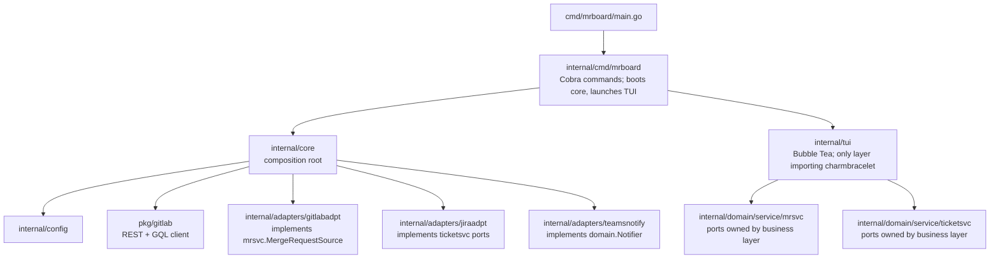
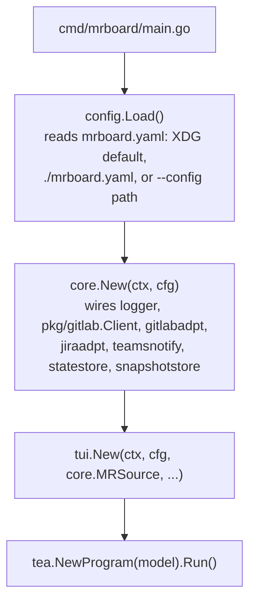

# Architecture

## Package dependency rules

Ports-and-adapters (hexagonal) layout. Dependency arrows point inward — outer layers depend on
inner abstractions, never the reverse.



| Package | Import constraint |
| --- | --- |
| `internal/domain` | stdlib only — zero non-stdlib imports |
| `internal/domain/service/mrsvc` | port interfaces; imports only `internal/domain` |
| `internal/domain/service/ticketsvc` | port interfaces; imports only `internal/domain` |
| `pkg/gitlab` | REST + GQL client; imports only stdlib + `net/http` libs |
| `internal/adapters/gitlabadpt` | implements `mrsvc`; imports `pkg/gitlab` + `internal/domain` |
| `internal/adapters/jiraadpt` | implements `ticketsvc` via `pkg/jira`, disk-cached |
| `internal/adapters/teamsnotify` | implements `domain.Notifier` for Microsoft Teams |
| `internal/adapters/statestore` | implements `domain.StateStore`; stdlib + file I/O |
| `internal/adapters/snapshotstore` | implements `domain.SnapshotStore`; stdlib + file I/O |
| `internal/adapters/demoadpt` | implements every driven port from an embedded fixture; see adr/0006 |
| `internal/core` | composition root; no TUI imports |
| `internal/tui` | charmbracelet v2; depends on `mrsvc`/`ticketsvc` interfaces, never on adapters |

`internal/tui` depends on `mrsvc.MergeRequestSource` (the port), not on any adapter directly.
This keeps every backend swappable and makes the TUI fully unit-testable with generated mocks.

The same rule applies to every other vendor integration (JIRA, Teams, ...), not just GitLab: a
concrete vendor name may appear as a Go identifier only inside that vendor's own adapter package,
in `internal/domain` (shared business rules that legitimately encode a vendor's data shape, e.g.
`domain.ExtractJiraID`), and in `internal/core` (the composition root, which must name concrete
adapters to construct them). Service ports (`internal/domain/service/*svc`) and `internal/tui`
name the capability, not the vendor — see AGENTS.md rule 7 for the full statement and exceptions
(config schema, user-visible display text).

## Data flow



On startup the TUI boots from `domain.SnapshotStore.Load()` (see
`docs/adr/0005-incremental-fetch-and-selection-identity.md`): a warm cache renders the board
immediately, fully interactive, at any age, while a `FetchAllCmd` runs in the background. A cold
cache (nothing to load) is the only case that shows the loading state. `FetchAllCmd` calls
`MergeRequestSource.FetchAll(ctx, mrsvc.FetchOptions{Previous: m.allMRs, ...})`, passing the
current in-memory snapshot so `gitlabadpt` can diff `UpdatedAt` and skip re-fetching discussions
for unchanged MRs. Every landed `FetchResultMsg` is persisted via `SnapshotStore.Save`. Manual
refresh (`r`) and the `refresh_interval` timer both repeat the same cycle; a tick is skipped while
a fetch is already in flight.

Each landed fetch also drives, in order: ticket enrichment and the JIRA description back-link via
`ticketsvc.TicketEnricher`/`TicketLinker` (`docs/adr/0003-jira-remote-links.md`), then
`mrsvc.AutoAssignReviewers` for newly opened, ticket-linked MRs with no reviewers yet, gated by
`auto_assign_reviewers.enabled` (`docs/adr/0009-auto-assign-reviewers.md`). `mrboard update` runs
the same auto-assign step as a standalone command, outside the TUI.

Detail panel (`↵`) calls `MergeRequestSource.GetDetail(ctx, projectID, mrIID)`.

Diff view (`d`) calls `MergeRequestSource.GetDiff(ctx, projectID, mrIID)`, then lazily calls
`MergeRequestSource.GetFileContent(ctx, projectID, path, ref)` per file on demand.

Approver editor (`a`) calls `GetProjectMembers` / `SaveApprovers` and re-fetches the affected
MR via `FetchMR` after a successful write.

The Notify keybinding (`n`) calls `domain.Notifier.Notify(ctx, mr)`, implemented by `teamsnotify`
for Microsoft Teams.

## File layout

```
mrboard/
  cmd/mrboard/
    main.go                # Signal handling; calls mrboardcmd.Execute
  internal/
    cmd/mrboard/
      root.go              # Cobra root command; boots core, launches the board by default
      board.go             # execBoard — launches the TUI
      fetch.go             # `mrboard fetch` — one-shot JSON dump, mirrors the TUI's read path
      update.go            # `mrboard update` — one-shot auto-assign-reviewers write (adr/0009)
      version.go           # `mrboard version` subcommand
    config/
      config.go            # AppConfig, Load(), typed sub-config accessors
      demo.go              # DemoConfig() — in-memory config for --demo, no file/network needed
    core/
      core.go              # Composition root — builds and wires all dependencies
      demo.go              # NewDemo() — wires Core against demoadpt instead of real adapters
    domain/
      mr.go                # All domain types (see domain-model.md)
      state.go             # StateStore + SnapshotStore interfaces
      service/mrsvc/
        mrsvc.go           # MergeRequestSource port + SourceType, Source, Config
        filter.go          # MR filtering helpers
        auto_assign.go     # AutoAssignReviewers eligibility + write (adr/0009)
        reviewer_writes.go # ApplyReviewerChanges — shared reviewer/approver write path
        mocks/             # mockery-generated doubles
      service/ticketsvc/
        ticketsvc.go       # Vendor-neutral TicketEnricher/TicketLinker ports
        mocks/             # mockery-generated doubles
    adapters/
      gitlabadpt/
        gitlabadpt.go      # MergeRequestSource implementation (REST + GQL)
        mapper.go          # Maps pkg/gitlab types → domain.MergeRequest
        dedup.go           # Cross-source deduplication
      jiraadpt/
        jiraadpt.go        # ticketsvc.TicketEnricher + TicketLinker via pkg/jira, disk-cached
      teamsnotify/
        teamsnotify.go     # domain.Notifier for Microsoft Teams via a Power Automate webhook
      statestore/
        statestore.go      # domain.StateStore on local disk (XDG data dir)
      snapshotstore/
        snapshotstore.go   # domain.SnapshotStore — versioned JSON cache (XDG cache dir)
      demoadpt/
        demoadpt.go        # every driven port, backed by an in-memory dataset (--demo)
        fixture/board.yaml # the embedded demo dataset; see adr/0006-demo-mode.md
    log/
      log.go               # slog wrapper (file + stderr)
    tui/
      keys.go              # Concrete KeyMap structs + per-context bindings — keybindings live here only
      keymap.go            # Action/Context/Category primitives + Act() — generic keybinding infra
      styles.go            # Styles struct — all lipgloss styles live here only
      model.go             # Root tea.Model — program state, message routing
      dirtyset.go          # dirtySet — guards in-flight local edits against a stale fetch overwrite
      board.go             # Board widget — column layout, cross-column focus
      column.go            # Column widget — one per MRPhase
      card.go              # MR card widget — one per domain.MergeRequest
      detail.go            # Detail panel widget — description + discussion threads
      diff_view.go         # Full-screen diff view widget (press d)
      approver_editor.go   # Approver editor overlay (press a)
      batch_preview.go     # Preview overlay for a batch reviewer edit
      settings_widget.go   # Settings overlay (press ,) — Filters/Sorting/Theme tabs
      overlay_router.go    # overlayKind — which exclusive overlay owns input focus
      help_modal.go        # Full keybinding help modal (press ?)
      command_argv.go      # Resolves external-command argv templates against MR metadata (adr/0004)
      jira_icons.go        # Issue-type icon lookup for JIRA-linked MR titles
      footer.go            # Help/keybinding bar
      header.go            # Header bar (title + stats)
      spinner.go           # Loading overlay
      state.go             # Shared TUI state types
      viewport.go          # Viewport helper
      theme.go             # Theme application to Styles
      themes.go            # Built-in theme definitions
  pkg/
    gitlab/
      client.go            # Authenticated REST + GQL client
      graphql.go           # GraphQL query helpers
      config.go            # pkg/gitlab.Config
    jira/                  # JIRA REST client, used by internal/adapters/jiraadpt
    theme/
      model.go             # Theme model
      theme.go             # Token → color resolution
  docs/
    architecture.md        # This file
    domain-model.md
    tui-conventions.md
    configuration.md
    theme-format.md
    keybindings.md
    clean_architecture.md
    adr/                   # Architecture Decision Records
    agents/                # Pointer docs for agent workflow (issue tracker, triage labels, domain docs)
  mrboard.yaml.example
  AGENTS.md                # Symlinked as CLAUDE.md
```

## Dependencies

| Package | Purpose |
|---|---|
| `charm.land/bubbletea/v2` | TUI event loop (Elm architecture) |
| `charm.land/lipgloss/v2` | Terminal styling |
| `charm.land/bubbles/v2` | Pre-built widgets (spinner, key bindings, help, viewport) |
| `github.com/spf13/viper` | YAML config loading + env-variable binding |
| `github.com/go-ozzo/ozzo-validation/v4` | Declarative config validation |
| `github.com/spf13/cobra` | CLI command structure |

## Config

Loaded from `~/.config/mrboard/mrboard.yaml` (XDG default), `./mrboard.yaml`, or a path given
with `--config`/`-c`. `$GITLAB_TOKEN` overrides `gitlab.token` and `$JIRA_TOKEN` overrides
`jira.api_token`, both from the config file.

```yaml
gitlab:
  url: https://gitlab.example.com
  token: glpat-xxx          # or set $GITLAB_TOKEN; needs api scope for write operations
  timeout: 30s              # default: 30s

sources:
  - type: group
    ids: [my-team]

  - type: user
    ids: [alice, bob]

excluded_authors:
  - renovate-bot

current_user: alice

log:
  path: /tmp/mrboard.log    # optional; omit to disable
  level: info               # debug | info | warn | error
```
